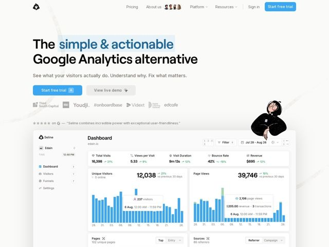

# Seline — https://seline.so

- **niche:** analytics
- **mood:** clean-light
- **style:** minimal, illustrated, mono-type
- **palette:** bg `#FFFFFF` · ink `#0A0A0A` · accent `#3B9EFF` — Headline highlight swash behind 'simple & actionable', primary CTA button fill, and the entire product-dashboard chart bars/active states
- **type:** display *Geometric grotesque sans (DM Sans / Inter-adjacent), heavy weight* · body *Same family at regular weight, generous size* — Tight, confident, oversized black headlines that feel like a manifesto; friendly rounded counters keep it approachable rather than corporate
- **sections:** hero › logos › testimonials › feature-walkthrough › how-it-works › feature-grid › integrations › faq › cta › footer
- **signature:** A hand-drawn, slightly melancholic illustrated character (a person resting their chin on folded arms) floats at the hero edge — injecting indie-zine warmth and human personality into a category that is otherwise wall-to-wall sterile chart screenshots and gradients.
- **imagery:** A pixel-accurate product dashboard rendered large and crisp directly below the fold (real bar charts, tooltips, KPI strip), paired with a loose ink illustration of a person. The contrast of high-fidelity UI against casual line-art is the whole visual language.
- **copy:** Direct positioning-as-headline with a highlighted value phrase: "The simple & actionable Google Analytics alternative" — subhead is plain, imperative, and outcome-driven: "See what your visitors actually do. Understand why. Fix what matters."

**Takeaways (steal as ideas, don't copy):**
- Highlight the load-bearing adjectives in your headline with a soft accent-color swash block instead of bolding — it reads like a marker pen and draws the eye to the differentiator, not the whole line.
- Pair a clinical, true-to-life product screenshot with one warm hand-drawn illustration; the tension humanizes a data-heavy SaaS without resorting to stock 3D blobs.
- Stack social proof tightly under the CTA: grayscale customer logos immediately followed by a single starred pull-quote, so trust lands before the user even scrolls.
- Add tiny keyboard-shortcut chips ('A', 'R') inside buttons and UI to signal a fast, power-user, keyboard-driven product right in the marketing visuals.
