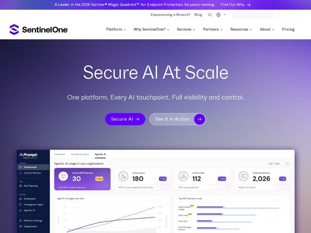

# Sentinelone — https://sentinelone.com

- **niche:** security
- **mood:** technical-dark
- **style:** gradient, dark, cinematic
- **palette:** bg `#3A2E7A` · ink `#FFFFFF` · accent `#6A3FF0` — primary 'Secure AI' CTA pill, circular arrow buttons, sidebar nav highlight and metric icons inside the product dashboard
- **type:** display *Geometric humanist sans (single-story 'a', wide tracking) — SentinelOne brand sans in the spirit of Gilroy/Circular* · body *Same family at lighter weight, generous letter-spacing* — Calm, confident, oversized-but-friendly — enterprise authority softened by rounded warmth rather than hard military edge
- **sections:** announcement-bar › hero › feature-stop-threats › feature-amplify-humans › feature-simplify-ops › how-it-works › news-events › testimonials › logos › cta › footer
- **signature:** A purple-to-violet gradient haze for the whole hero instead of the obligatory black/neon-green "hacker" aesthetic — the dark security category rendered as a soft, premium dusk rather than a terminal. A real, legible product dashboard (MCP/Agentic-AI metrics) is collaged at the fold so the screen IS the proof.
- **imagery:** Photorealistic, lightly-shadowed product UI screenshot tilted into the gradient background — a working dashboard with sidebar nav, KPI cards (Active MCP Servers 30, Active users 180, 2,026 interactions) and dual-line trend charts. No abstract shields, locks, or matrix-rain clichés; the interface itself is the hero image.
- **copy:** Punchy 3-4 word power statements with a competitive/military undertone — hero (facts): "Built to Secure. Engineered for Advantage."; live variant: "Secure AI At Scale" + subhead "One platform. Every AI touchpoint. Full visibility and control."

**Takeaways (steal as ideas, don't copy):**
- Render a 'dark' technical category as a warm violet gradient dusk instead of black-and-neon — instantly differentiates from every competitor's terminal aesthetic
- Use staccato 4-word headlines ('Stop Threats Before They Start', 'Amplify Humans. Empower Teams.') as section anchors — confident, scannable, ownable phrasing
- Pair a solid-fill primary CTA pill with a ghost/outline secondary that carries its OWN filled circular-arrow chip — two distinct CTA weights without color clash
- Let the actual product dashboard be the hero image, collaged at the fold edge — concrete metrics (real numbers, real charts) sell capability better than abstract shield iconography
