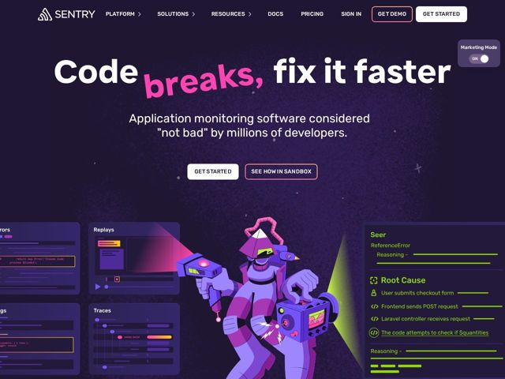

# Sentry — https://sentry.io

- **niche:** dev-tools
- **mood:** technical-dark
- **style:** dark, bold-loud, illustrated, mono-type
- **palette:** bg `#1B1233` · ink `#F5F2FA` · accent `#FF45A8` — a palavra "breaks," na headline recebe o tratamento rosa-choque + script à mão; um acento secundário verde-ácido (#B6FF3D) conduz os painéis de UI de diagnóstico (linhas de Reasoning, rastros de Root Cause)
- **type:** display *Rubik (peso heavy, quase-black)* · body *Rubik / grotesca de sistema* — Alto, encorpado, quase como um pôster. A sans ultra-bold justa da headline lê mais como uma camiseta de banda ou marca de skate do que software de monitoramento enterprise; os terminais arredondados a mantêm amigável em vez de corporativa.
- **sections:** hero › feature-developer-first › feature-everythings-connected › feature-ai-debugging › testimonials › how-it-works › feature-security › cta-newsletter › footer
- **signature:** Um toggle "Marketing Mode: ON" fixado no canto superior direito do hero — uma piscadela autoconsciente que admite abertamente que a página é marketing, quebrando o tom sincero e polido que todo outro fornecedor de monitoramento encena. Combinado com um "breaks," rosa rabiscado à mão por cima da sans de resto bold, sinaliza "feito por devs que não levam o funil tão a sério."
- **imagery:** Ilustração de personagem custom como peça central do hero: um astronauta/mascote cartoon roxo empunhando ferramentas de debugging tipo raio-laser, contra um gradiente de espaço profundo com um sutil campo de estrelas e um feixe de luz verde. Ladeado por trechos flutuantes de UI de produto (Errors, Replays, Traces, painéis Seer/Root Cause) renderizados como cards brilhantes em modo escuro — superfícies reais do produto vestidas como adereços de história em quadrinhos em vez de screenshots limpos de dashboard.
- **copy:** Humor de dev irreverente e autodepreciativo que se subvaloriza de propósito — H1: "Code breaks, fix it faster" com subhead "Application monitoring software considered \"not bad\" by millions of developers."

**Takeaways (roube como ideias, não copie):**
- Misture uma palavra de acento desenhada à mão/em script DENTRO de uma headline sans ultra-bold ("breaks," rosa sobre Rubik black) para injetar personalidade sem trocar de fonte na página inteira.
- Use um controle de UI falso como piada — o toggle "Marketing Mode: ON" — para desarmar um público técnico cético e sinalizar humor de grupo interno.
- Implante um segundo acento de alta-voltagem (verde-ácido) reservado exclusivamente para os painéis de diagnóstico/IA, para que o UX real de rastreamento de sinal do produto leia como seu próprio sistema visual distinto do rosa da marca.
- Enquadre screenshots reais de produto como adereços de quadrinhos numa cena de personagem em vez de recortes estéreis de dashboard — transforma uma ferramenta de monitoramento num mundo de mascote memorável.
