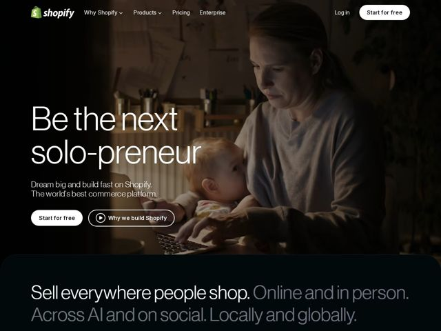

# Shopify — https://shopify.com

- **niche:** consumer
- **mood:** premium-luxe
- **style:** photographic, dark
- **palette:** bg `#0B0E0E` · ink `#FFFFFF` · accent `#5E8E3E` — Restrained — only the Shopify bag logo mark is the signature green; CTAs and UI are monochrome (white pill on dark). Accent is brand-identity, not button-system.
- **type:** display *Shopify Sans (custom grotesque, near-Helvetica/Inter)* · body *Shopify Sans* — Tall, tight, optically-large grotesque — confident, neutral, editorial; headlines set at near-poster scale with snug leading
- **sections:** hero › feature-sell-everywhere › feature-brand-ai › feature-sidekick-ai › feature-why-build-here › cta-build-fast › feature-sell-more-places › feature-grow-global › feature-segments › feature-commerce-ai › feature-analytics › feature-apps-customize › feature-ai-core › feature-checkout › feature-performance › feature-support › footer
- **signature:** The full-bleed cinematic hero photo is dimmed and graded into near-blackness so the white type sits ON the photograph rather than in a box — the image and the dark background are the same value, making the headline feel printed onto the scene instead of layered over it.
- **imagery:** Documentary photography, not product screenshots: a real person (mother with a baby on her lap at a laptop) shot in warm, low-key natural light, heavily darkened toward the edges. Treatment is filmic — moody, intimate, candid-aspirational. Product UI is withheld from the fold entirely.
- **copy:** Aspirational second-person identity statement, not a feature pitch — visible hero reads 'Be the next solo-preneur' (A/B variant 'Be the next AI all-star'); subhead 'Dream big and build fast on Shopify. The world's best commerce platform.' Voice: punchy, coined-word ('solo-preneur'), big-promise.

**Takeaways (steal as ideas, don't copy):**
- Flatten the hero: grade the background photo down to the same near-black value as the page so type sits directly on the image with no card or scrim box — image becomes the canvas, not a banner.
- Use a two-tone section opener: lead a section with a bright-white sentence, then continue the SAME sentence in mid-gray ('Sell everywhere people shop. Online and in person.') so one giant paragraph self-emphasizes without bold or accent color.
- Spend your brand color on exactly one element (the logo) and run every CTA in monochrome — proves premium restraint and makes the dark palette read as luxury, not default.
- Sell the customer's future identity in the H1 ('Be the next ___') with a coined compound word, and demote all product/feature language to subhead and below-fold.
