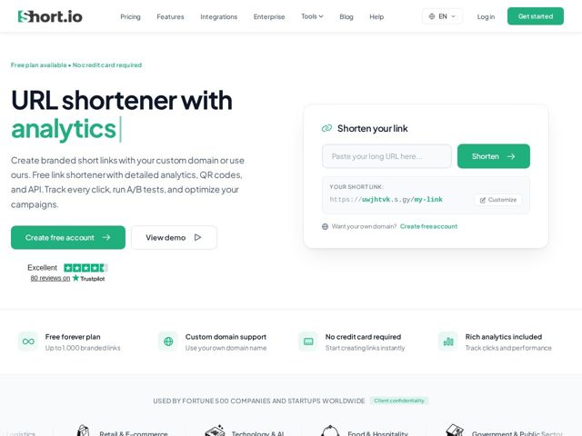

# Short — https://short.io

- **niche:** dev-tools
- **mood:** clean-light
- **style:** minimal, mono-type
- **palette:** bg `#FFFFFF` · ink `#16223A` · accent `#21C275` — botões CTA primários (Get started, Shorten, Create free account), a palavra de segunda linha do hero 'analytics', o símbolo do logo, o ícone de link, o texto de confiança do eyebrow e os preenchimentos dos ícones de feature
- **type:** display *Sans geométrica (estilo DM Sans / Poppins, peso heavy)* · body *Mesma família, peso regular* — Amigável-utilitária: as letras geométricas arredondadas a mantêm acessível, mas o peso display heavy e justo sinaliza confiança de produto. Lê mais 'SaaS de consumo' do que enterprise.
- **sections:** hero › feature-strip › logos › feature-industries › feature-grid › how-it-works › integrations › feature-personas › stats › testimonials › faq › cta › footer
- **signature:** Uma demo de produto interativa ao vivo embutida diretamente no hero — um campo real de 'Shorten your link' que gera uma URL curta funcional (https://uwjhtvk.s.gy/my-link) com um botão Customize, de modo que a página É o produto. A página substitui o usual screenshot de hero morto pela ferramenta de verdade que você veio usar.
- **imagery:** Quase nenhuma fotografia. O hero é um card de widget dentro do produto (arredondado, com sombra suave) atuando tanto como demo quanto como âncora visual. Em outros lugares: ícones de linha simples em dois tons em quadrados arredondados verde-pálido, um conjunto de ícones de indústria desenhados à mão de forma esboçada (logística, varejo, tech, alimentação) e a avaliação de estrelas do Trustpilot embutida. UI-como-imagética em vez de ilustração ou banco de imagens.
- **copy:** Direta, benefício-primeiro, sem jargão — começa com a categoria exata ('URL shortener with analytics') e então empilha capacidades concretas (QR codes, A/B tests, API) em vez de slogans.

**Takeaways (roube como ideias, não copie):**
- Faça o hero ser o produto: embuta uma mini-ferramenta real e funcional (input -> resultado ao vivo) em vez de um screenshot estático, para que os visitantes recebam valor antes de rolar.
- Headline de hero em duas cores: renderize a palavra diferenciadora ('analytics') no verde da marca contra o texto escuro para telegrafar a proposta de valor num único olhar.
- Empilhe prova forte na zona do hero — eyebrow 'No credit card required' + avaliação do Trustpilot + uma faixa de 4 benefícios — para neutralizar o atrito imediatamente abaixo da dobra.
- Use um sistema de chips de ícone verde-pálido (quadrados arredondados mint) para fazer uma ferramenta utilitária densa parecer calma e escaneável em vez de pesada-enterprise.
