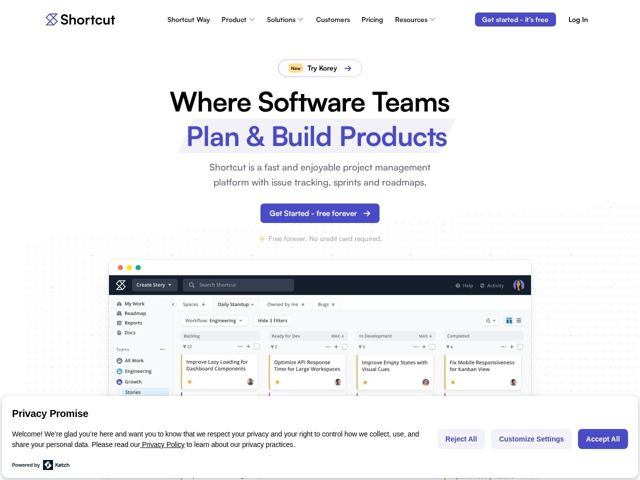

# Shortcut — https://shortcut.com

- **niche:** dev-tools (gestão de projetos / rastreamento de issues para times de software)
- **mood:** clean-light
- **style:** minimal, mono-type, bold
- **palette:** bg `#FFFFFF` · ink `#111114` · accent `#5A4FE0` — a segunda linha da headline 'Plan & Build Products', os botões CTA primários, os acentos de chrome de UI dentro do produto e o símbolo do logo X
- **type:** display *Sans grotesca heavy (comprimida, peso quase-black — lê como uma grotesca estilo Helvetica/Akzidenz com tracking apertado)* · body *Sans humanista neutra, peso light-a-regular* — Headline alta, condensada, quase de pôster, contrastada com um corpo de texto fino e arejado — uma voz de capa de revista vestindo o uniforme de uma ferramenta dev
- **sections:** hero › feature-create-track-work › feature-daily-progress › feature-connect-work-to-goals › feature-work-your-way › feature-ai-agent › feature-integrations › feature-scale-security › testimonials › cta › footer
- **signature:** A segunda linha da headline do hero ('Plan & Build Products') fica dentro de um destaque de tira de papel rasgada à mão e levemente rotacionada em roxo de acento — uma textura analógica de papel rasgado largada num layout de SaaS digital de resto nítido, quebrando a convenção de vetor chapado do gênero.
- **imagery:** Um único screenshot de produto realista e superdimensionado do quadro Kanban (com chrome de navegador macOS e pontos de farol) ancorado diretamente sob o hero num pano de fundo discreto de grade pontilhada; produto-como-hero em vez de ilustração. Sem mascotes ou 3D abstrato — a UI real carrega o peso visual.
- **copy:** Promessa de benefício direta numa headline display gigante em dois tons — o hero diz 'Where Software Teams Plan & Build Products,' subhead 'Shortcut is a fast and enjoyable project management platform with issue tracking, sprints and roadmaps.'

**Takeaways (roube como ideias, não copie):**
- Divida uma headline em dois tratamentos de tipo: tinta black heavy para a linha de preparação, cor de acento dentro de um destaque de papel rasgado para a linha de desfecho — hierarquia de ênfase instantânea sem uma segunda fonte.
- Comece com um campo discreto de grade pontilhada atrás de um screenshot de produto realista emoldurado por chrome para que a UI real vire a imagem do hero em vez de ilustração de banco.
- Combine um tipo display grotesco condensado e superdimensionado com um corpo de texto deliberadamente fino e espaçoso — o contraste de peso faz o trabalho do 'bold' mantendo a página calma e legível.
- Empilhe uma pílula 'New — Try [feature]' acima do H1 como uma chamada de baixa fricção de notícias de produto que também serve de CTA secundário sem lotar o botão primário.
