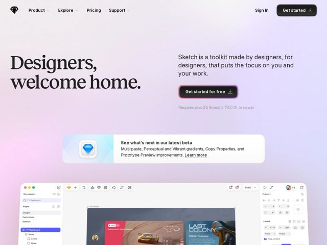

# Sketch — https://sketch.com

- **niche:** design
- **mood:** editorial-minimal
- **style:** minimal, gradient, photographic, colorful
- **palette:** bg `#EAD9F0` · ink `#1A1A1A` · accent `#F23E6E` — contorno de anel/glow no botão CTA primário, mais a lavagem rosa-para-violeta no pano de fundo em gradiente do hero e o link inline 'Learn more'
- **type:** display *Sectra / serifa de alto contraste (headline editorial grande)* · body *Sans-serif geométrica (estilo system/Inter)* — Literário-encontra-utilitário: uma headline serifada quente e superdimensionada sinaliza craft e boas-vindas, enquanto o corpo sans limpo mantém o marketing-de-ferramenta legível e moderno
- **sections:** hero › feature-beta-callout › feature-product-ui › feature-design › feature-prototype › feature-collaborate › feature-discover › feature-updates › pricing › cta › footer
- **signature:** Uma headline emocional carregada de serifa ("Designers, welcome home.") sobre um gradiente pastel iridescente suave faz a página ler como uma capa de livro literário em vez de uma ferramenta dev técnica — rejeitando deliberadamente a estética de screenshot-de-UI em modo escuro que seus concorrentes adotam por padrão.
- **imagery:** Gradiente de aurora rosa-violeta perolado como pano de fundo full-bleed; abaixo da dobra, um screenshot realista em cor fiel da tela real do app (mockup de dashboard de TV + painéis de inspetor) mostrado numa escala leve, sangrando para fora da borda inferior. O produto é mostrado honestamente em vez de abstraído em ícones.
- **copy:** Boas-vindas quentes, humanas, em segunda pessoa em vez de feature-speak — o hero diz "Designers, welcome home." com subhead "Sketch is a toolkit made by designers, for designers."

**Takeaways (roube como ideias, não copie):**
- Combine uma headline serifada de alto contraste e superdimensionada com um subhead sans limpo para fazer um produto de software parecer trabalhado e humano, não corporativo
- Use um gradiente pastel iridescente suave (rosa->violeta->azul) como tela inteira em vez de branco chapado ou modo escuro para telegrafar um público criativo/de design
- Adicione um sutil anel de glow colorido ao redor do único CTA primário para que ele se destaque sem um preenchimento sólido berrante sobre o gradiente movimentado
- Largue um slim card de chamada embutido 'See what's next in our beta' com um ícone de produto para destacar frescor e energia de changelog logo abaixo da dobra
