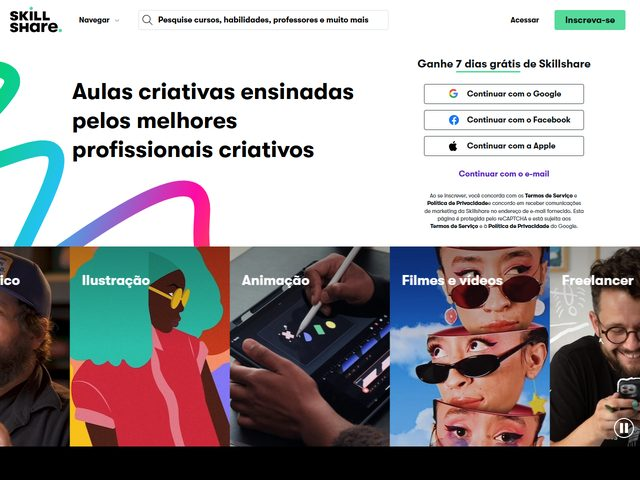

# Skillshare — https://www.skillshare.com

- **niche:** education
- **mood:** warm-playful
- **style:** colorful, photographic, friendly, signup-forward
- **palette:** bg `#FFFFFF` · ink `#0E0E0E` · accent `#00FF84` — Um verde-menta brilhante reservado de forma restrita para a pílula "Inscreva-se" no canto superior direito e o fino sublinhado embaixo de "grátis" no eyebrow; todo o resto (a fita arco-íris, as fotos dos tiles) é decoração, então o verde permanece o único sinal de "vá".
- **type:** display *grotesca geométrica, estilo Bouygues/Founders — plausivelmente Circular ou uma "Skillshare Sans" custom* · body *sans humanista, vizinha de GT Walsheim / Inter* — Quente e arredondada, conversacional em vez de corporativa; o wordmark compõe "SKILL / share." em duas linhas heavy empilhadas com um ponto verde.
- **sections:** hero › category-tiles › popular-classes-carousel › value-props › teacher-spotlight › testimonials › membership-pricing › cta › footer
- **signature:** A dobra é dividida: uma coluna esquerda branca e limpa com a headline fica ao lado de um card de cadastro OAuth totalmente construído (Google, Facebook, Apple, e-mail) — o formulário de conversão É o hero, não um passo posterior. Embaixo, uma tira de filme de largura total de tiles de categoria saturados ("Ilustração", "Animação", "Filmes e vídeos", "Freelancer") misturando ilustração chapada com fotografia real de makers roda de ponta a ponta, e uma fita em gradiente multicolorido desenhada à mão arqueia por trás do tipo a partir da margem esquerda — esse rabisco solto e pictórico é o que tira tudo isso da esterilidade padrão de SaaS.
- **imagery:** Mídia mista de propósito: uma fita-pincel em gradiente livre (teal→azul→magenta→amarelo) como floreio de fundo, ilustração de personagem chapada e ousada em alguns tiles, e fotos candid quentes de criadores reais (um homem de boné, alguém de óculos escuros, mãos sobre uma mesa digitalizadora) em outros — alta cor, sem 3D, sem screenshots de UI.
- **copy:** Simples, encorajadora, criador-para-criador — headline "Aulas criativas ensinadas pelos melhores profissionais criativos", eyebrow "Ganhe 7 dias grátis de Skillshare" (o gancho do trial gratuito declarado antes de qualquer pitch). Português localizado; o card OAuth carrega letras miúdas sobre Termos de Serviço e Política de Privacidade.

**Takeaways (roube como ideias, não copie):**
- Coloque o card de cadastro real (OAuth social + e-mail) diretamente na dobra ao lado da headline para que o hero funcione também como formulário de conversão.
- Comece o eyebrow com a oferta ("7 days free") e sublinhe apenas a única palavra que importa na cor de acento — uma única marca verde deliberada.
- Rode uma tira de filme de ponta a ponta de tiles de categoria saturados imediatamente abaixo da dobra para telegrafar amplitude instantaneamente, antes de qualquer texto explicá-la.
- Desenhe à mão uma única fita em gradiente multicolorido solta por trás de um tipo limpo para injetar calor e craft num layout de resto branco e limpo na grade.
