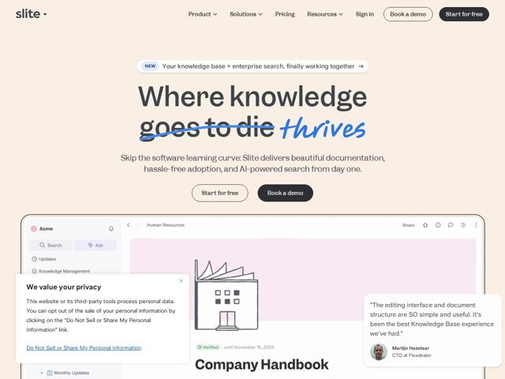

# Slite — https://slite.com

- **niche:** productivity
- **mood:** warm-playful
- **style:** minimal, illustrated, mono-type
- **palette:** bg `#F7EDE2` · ink `#3A3A3A` · accent `#2F6BFF` — hand-drawn marker strikethrough/underline on the hero word and the italic 'thrives'; NEW pill, link underlines
- **type:** display *Recoleta (or similar high-contrast humanist serif)* · body *Recoleta / matching serif at lighter weight* — Bookish and editorial — a friendly serif that reads like a well-set print book rather than a typical sans-serif SaaS, signalling 'documentation' and craft
- **sections:** hero › problem › feature-docs › logos › testimonials › feature-scale › feature-ai-search › cta › footer
- **signature:** The hero headline performs its own edit: 'goes to die' is struck through with a hand-drawn blue marker and replaced by a handwritten italic 'thrives' — a literal proofreading gesture that turns the H1 into a tracked-change, perfectly on-brand for a docs tool
- **imagery:** Warm cream canvas with a realistic product UI screenshot (Slite editor, sidebar, 'Ask' button) anchored bottom-center; loose pencil-style doodle illustrations inside docs (a factory line drawing); floating glassy testimonial card with a real headshot overlapping the product shot for social proof
- **copy:** Provocative self-aware promise that names the pain then crosses it out — hero reads 'Where knowledge goes to die thrives' (strikethrough on 'goes to die')

**Takeaways (steal as ideas, don't copy):**
- Make the headline DO the product's job: use a marker strikethrough + handwritten replacement so the H1 literally demonstrates editing/version control
- Swap the default SaaS sans for a bookish high-contrast serif on a cream paper bg to signal 'documentation' and warmth instead of cold tech
- Pair one clean product screenshot with hand-drawn doodles inside it — the contrast of polished UI + loose sketch reads human and approachable
- Overlap a glassy testimonial card with a real face onto the product shot so proof and product share one frame
