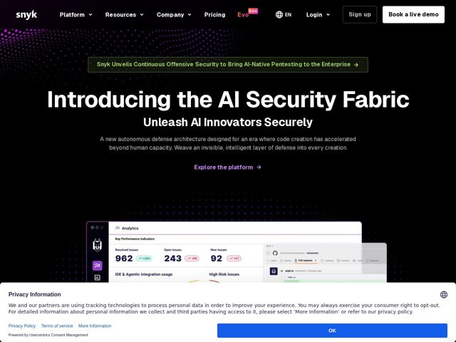

# Snyk — https://snyk.io

- **niche:** security
- **mood:** technical-dark
- **style:** dark, gradient, 3d
- **palette:** bg `#06060A` · ink `#FFFFFF` · accent `#8A5CF6` — announcement-bar text, the dotted nebula particle field bleeding from top-left, 'Explore the platform' link, scattered UI accents in the dashboard mockup
- **type:** display *Geomanist / GT-style geometric grotesque (heavy weight)* · body *Neutral humanist sans-serif (regular weight)* — Confident and engineered — an ultra-bold near-black display weight that reads as authoritative and almost editorial, paired with a quiet utilitarian body that stays out of the way
- **sections:** hero › announcement › feature-platform › testimonials › partners › resources › stats › cta › footer
- **signature:** A particle-nebula of magenta-to-violet dots bleeding diagonally from the top-left corner into pure black — a cosmic, almost generative-art field instead of the flat dark-grid or circuit-line backgrounds every other security site defaults to. It makes 'AI Security' feel atmospheric and organic rather than rigid and infrastructural.
- **imagery:** Floating, layered product-UI screenshots (analytics dashboard with big stat numbers, a GitHub pull-request panel) rendered as light cards stacked in 3D depth, set against the black void. Imagery language is 'real product surfaced as a constellation of panels' rather than abstract illustration — concrete metrics (962 resolved, 243 open) ground the lofty headline.
- **copy:** Visionary, manifesto-style category claim over feature-speak — quietly grand. Hero h1: 'Introducing the AI Security Fabric' with sub 'Unleash AI Innovators Securely'.

**Takeaways (steal as ideas, don't copy):**
- Lead with a coined category ('AI Security Fabric') as the h1 instead of describing the product — let a manifesto subhead ('Unleash AI Innovators Securely') and a poetic body line carry the meaning.
- Replace the genre-default dark grid/circuit background with an atmospheric particle-nebula gradient that bleeds from one corner — it reads as generative AI energy, not enterprise infra.
- Use a massive near-black geometric display weight for the headline so the page feels editorial and authoritative even on pure black.
- Stack real product screenshots as overlapping light cards floating in 3D depth over the void — concrete stat numbers prove substance under an abstract claim.
