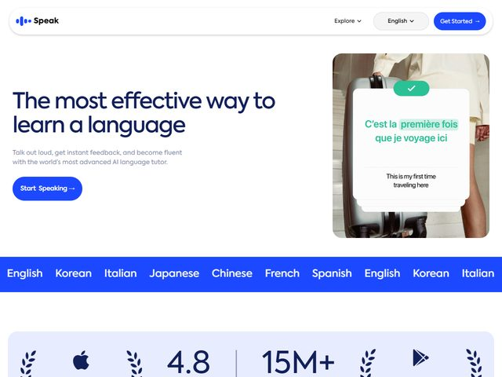

# Speak — https://www.speak.com

- **niche:** education
- **mood:** clean-light
- **style:** clean, photographic, friendly, product-ui
- **palette:** bg `#FFFFFF` · ink `#16203A` · accent `#2B4BF2` — Um azul royal saturado carrega os pontos do wordmark, a pílula "Get Started" da nav flutuante e o botão "Start Speaking" do hero; depois reaparece como uma faixa azul full-bleed que sustenta o ticker de idiomas (English · Korean · Italian…) abaixo da dobra, amarrando o CTA ao escopo do produto.
- **type:** display *grotesca geométrica, tipo Söhne / Inter, peso médio, tracking apertado num título de duas linhas* · body *mesma família, peso cinza mais leve* — Acessível e moderno, mais app de consumo do que acadêmico; o tipo é simples e caloroso, não autoritário.
- **sections:** hero › language-ticker › social-proof-stats › how-it-works › feature-ai-tutor › testimonials › pricing › cta › footer
- **signature:** O visual do hero é um momento de produto encenado, não uma foto de hero: uma foto real de um viajante com mala de rodinhas, sobreposta a um cartão inclinado da UI real do app mostrando uma tradução francesa ao vivo ("C'est la première fois que je voyage ici") acima de sua fonte em inglês ("This is my first time traveling here"), arrematado por um selo de check verde. Dramatiza o ato de falar uma frase corretamente — o ciclo de feedback vira a imagem.
- **imagery:** Fotografia de lifestyle (cena de viagem calorosa, tons creme/bege) fundida com um cartão flutuante da UI do produto; o cartão é girado alguns graus e sobreposto a um selo verde de "correct" para que a interface comunique um momento de sucesso em vez de uma captura de tela chapada.
- **copy:** Voz de consumo direta, com o benefício à frente. Título: "The most effective way to learn a language." Subtítulo: "Talk out loud, get instant feedback, and become fluent with the world's most advanced AI language tutor." CTA: "Start Speaking →". Uma faixa de confiança abaixo mostra "4.8" e "15M+" ladeados pelos selos da Apple e da Google Play com coroas de louros.

**Takeaways (roube como ideias, não copie):**
- Encene a UI do produto dentro de uma foto real de lifestyle e incline-a alguns graus — a interface vira um momento crível em vez de uma captura de tela estéril.
- Mostre o valor central do produto (uma tradução correta + check verde) literalmente acontecendo na dobra, para que o benefício seja demonstrado, não descrito.
- Rode um ticker full-bleed na cor de acento com as opções suportadas logo abaixo do hero para provar a amplitude num relance, sem uma seção de lista.
- Combine uma única alegação enorme ("most effective way to learn a language") com um CTA de verbo de ação ("Start Speaking") que ecoa o comportamento real do produto.
