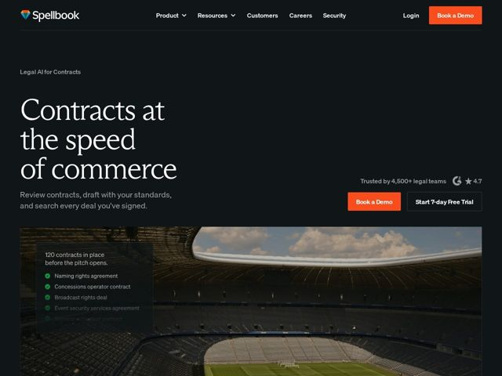

# Spellbook — https://spellbook.legal

- **niche:** legal-ai (contract review & drafting for legal teams)
- **mood:** technical-dark
- **style:** dark, editorial, photographic, cinematic
- **palette:** bg `#0E1116` · ink `#FFFFFF` · accent `#F0552B` — botões de CTA principais (Book a Demo), o símbolo de gema do logo e os acentos de check-bullet verdes no cartão flutuante sobreposto
- **type:** display *serifa transicional de alto contraste (classe Times/Georgia, provavelmente uma serifa refinada como Tiempos ou PP Editorial New)* · body *sans-serif geométrica humanista (classe Inter/Graphik) para nav, subtítulos e corpo* — Autoridade jurídica clássica (serifa) deliberadamente colidida com a sans limpa e moderna de SaaS — gravidade encontra velocidade
- **sections:** hero › how-it-works › feature-intake › feature-first-pass › feature-search › feature-review › feature-drafting › feature-agent › feature-citations › feature-benchmarking › feature-security › stats › audience-split › testimonials › case-studies › compliance › cta › footer
- **signature:** Uma foto cinematográfica ampla de um estádio vazio como imagem do hero — a convenção de legal-AI é captura abstrata de UI ou mockups estéreis de documentos, mas aqui um local real e literal ancora os contratos no comércio, com um cartão de vidro flutuante listando contratos de negócio reais ("120 contracts in place before the pitch opens") sobreposto à foto para amarrar o produto a um cenário tangível.
- **imagery:** Fotografia de banco de imagens cinematográfica, full-bleed e dessaturada (um estádio esportivo vazio) usada como cena emotiva em vez de foto de produto; um cartão de vidro escuro translúcido com itens de lista com check verde flutua sobre a imagem para fazer a ponte entre o contexto do mundo real e a saída do software. A imagem é editorial e cenográfica, não orientada por capturas de tela.
- **copy:** Confiante, com o benefício à frente e um tema de velocidade — título serifado do hero "Contracts at the speed of commerce" sobre o subtítulo direto "Review contracts, draft with your standards, and search every deal you've signed."

**Takeaways (roube como ideias, não copie):**
- Combine uma display serifada de alto contraste com uma UI sans limpa para sinalizar 'instituição confiável + velocidade moderna' — permite que um produto regulado/jurídico pareça ao mesmo tempo crível e rápido.
- Substitua a obrigatória captura de tela do produto no hero por uma cena cinematográfica do mundo real, e então faça um pequeno cartão de vidro com dados flutuar sobre ela para traduzir software abstrato numa situação concreta.
- Ancore a confiança inline ao lado do CTA em vez de numa faixa separada: 'Trusted by 4,500+ legal teams' + uma nota G2 de 4.7 estrelas ficam logo ao lado dos botões, onde a decisão acontece.
- Conduza o fluxo de seções com uma narrativa de workflow orientada por verbos (intake -> first pass -> put to work) para que os títulos de recurso se leiam como um processo, não um despejo de funcionalidades.
