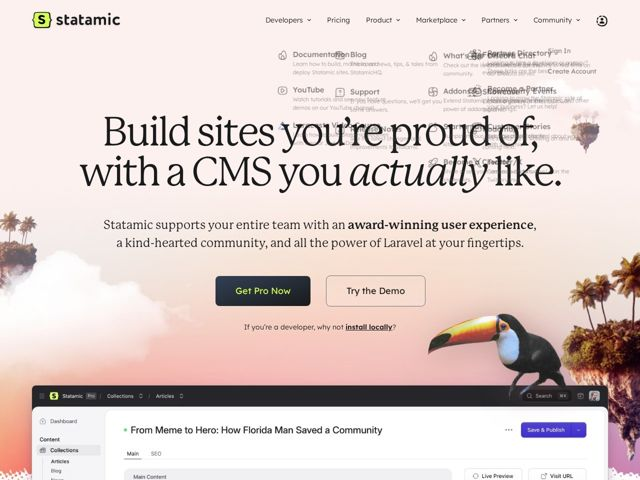

# Statamic — https://statamic.com

- **niche:** dev-tools (Laravel CMS / content management)
- **mood:** warm-playful
- **style:** illustrated, photographic, gradient, editorial-minimal
- **palette:** bg `#F7D9C4` · ink `#1B1B23` · accent `#D6F24B` — lime-yellow on the logo glyph and 'Save & Publish' button in the CP screenshot; otherwise the page's 'accent' is the warm coral/peach sunset gradient itself
- **type:** display *Lexend (heavy weight, used at huge scale with an italic cut for emphasis on 'actually')* · body *Lexend* — Single-family system: Lexend pushed into editorial territory — a humanist sans set so large and tight it reads like a magazine serif headline. Confident, warm, literary rather than technical.
- **sections:** hero › feature-control-panel › feature-scales-database › feature-ecosystem-addons › showcase-built-with › how-it-works-demo › community › docs › cta-newsletter › footer
- **signature:** A dev-tools CMS that opens with a tropical sunset photo-collage — peach gradient sky, palm-tree silhouettes, and a real toucan cut-out wading into the layout — instead of the obligatory dark terminal/code aesthetic. It trades 'serious infra' signaling for vacation-postcard warmth.
- **imagery:** Photographic collage over a hand-tuned gradient: a wide coral-to-peach sunset backdrop with layered palm-tree silhouettes and a photorealistic toucan composited at the bottom-right edge. Beneath the hero sits a crisp, realistic product screenshot of the Statamic control panel (a blog article editor) anchoring the marketing claims in real UI. Faux/ghosted mega-menu panels float semi-transparent behind the headline.
- **copy:** Conversational, self-aware, anti-jargon — names the user's pain ('frustrating CMS problems') and leans on personality. Hero headline: "Build sites you're proud of, with a CMS you actually like."

**Takeaways (steal as ideas, don't copy):**
- Set an oversized humanist sans (Lexend) at near-display scale with a single italic word for emphasis — a sans can carry editorial gravitas that usually requires a serif.
- Reject your niche's default mood on purpose: a warm tropical photo-collage on a dev tool reads as confident and human where competitors all go dark-terminal.
- Pair the playful hero with a pixel-accurate real product screenshot directly below, so warmth doesn't cost credibility.
- Write headlines that name the user's emotion ('a CMS you actually like') instead of features — emphasis on the one honest word does the persuading.
