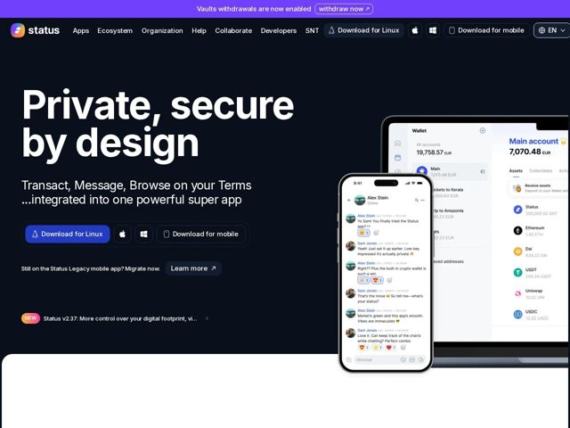

# Status — https://status.app

- **niche:** crypto / web3 (privacy-first super app — messenger + wallet + browser)
- **mood:** technical-dark
- **style:** dark, minimal, 3d, photographic
- **palette:** bg `#0E1419` · ink `#FFFFFF` · accent `#4360DF` — botões de CTA principais (Download for Linux), preenchimento do banner promocional no topo, links e símbolo da marca; levado para dentro da UI do produto mostrada nos mockups
- **type:** display *Inter (peso heavy/black, tracking apertado)* · body *Inter* — Grotesca neutra de nível engenharia levada a um peso black superdimensionado no título — confiante, direta, quase editorial. A display parece uma declaração, não enrolação de marketing; o corpo se mantém calmo e humilde.
- **sections:** promo-banner › hero › feature-own-crypto › feature-private-messaging › feature-token-gated-communities › feature-portfolio-wallet › feature-be-unstoppable › how-it-works-keycard › feature-built-different › blog-stay-up-to-date › token-snt › roadmap-l2 › cta › footer
- **signature:** O hero usa um render de produto quase em tamanho real e levemente fora de quadro: uma tela de chat real de iPhone sobrepondo um dashboard de carteira em laptop, ambos sangrando para além da borda direita e projetando sombras suaves sobre a tela escura — tratando o app como um objeto físico sobre uma mesa em vez do clichê de captura flutuante chapada que os sites de crypto usam por padrão. O resultado se lê mais como um lançamento de hardware de consumo do que um projeto de token.
- **imagery:** Mockups de dispositivos de alta fidelidade (telefone + laptop) mostrando UI genuína do app — uma conversa de messenger com reações de emoji e uma lista de carteira multiativos. Profundidade realista, sombras projetadas e recorte parcial criam uma encenação tátil e fotográfica. A imagem faz a persuasão: em vez de gráficos abstratos de crypto, mostra duas pessoas normais trocando mensagens, humanizando um produto Web3.
- **copy:** Voz de manifesto direta, principista e antivigilância — o hero diz "Private, secure by design" com o subtítulo "Transact, Message, Browse on your Terms ...integrated into one powerful super app."

**Takeaways (roube como ideias, não copie):**
- Ancore um hero de privacidade/crypto numa conversa de chat humana e crível (nomes reais, papo casual, reações de emoji) em vez de arte abstrata de blockchain — faz uma categoria intimidante parecer um app de consumo.
- Comece com CTAs de download específicos de plataforma (Linux, Apple, Windows, mobile) mostrados como um único controle segmentado — sinaliza 'software de verdade para power users' e amplia o caminho de instalação numa única linha.
- Use um banner promocional fino de largura total acima da nav para notícias de produto sensíveis ao tempo (ex.: 'Vaults withdrawals are now enabled') com um botão de ação inline — mantém o hero limpo enquanto expõe o momentum.
- Combine uma pílula NEW + um teaser de changelog com tag de versão ('Status v2.37: More control over your digital footprint') perto do hero para sinalizar desenvolvimento ativo e em entrega sem poluir o título.
