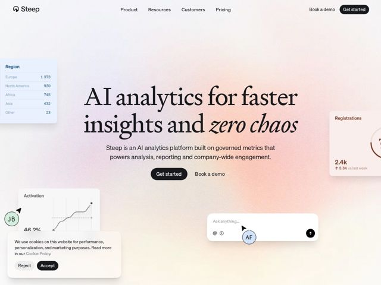

# Steep — https://steep.app

- **niche:** analytics
- **mood:** clean-light
- **style:** gradient, editorial, minimal
- **palette:** bg `#F3EDEA` · ink `#2A2A2E` · accent `#E9A38B` — gradiente aurora suave de pêssego-para-lilás lavando toda a tela do hero; tons coral quentes nos cartões de métrica flutuantes (registrations, activation) e nos chips de avatar
- **type:** display *serifa transicional de alto contraste (tipo Times/Georgia, com um itálico verdadeiro para palavras de ênfase)* · body *sans-serif grotesca neutra (tipo Inter/Helvetica)* — Editorial e literária no topo, calma e utilitária abaixo — um cabeçalho de revista aparafusado numa ferramenta de dados
- **sections:** hero › feature-intro › feature-engagement › testimonial › feature-metrics › feature-analysis › cta › footer
- **signature:** Um título serifado em itálico flutuando sobre um gradiente aurora pastel quente — o exato oposto do visual escuro, monoespaçado e de grade neon que toda outra ferramenta de AI-analytics usa por padrão. Veste uma plataforma de BI como um editorial literário.
- **imagery:** Sem fotografia ou ilustração. Fragmentos reais da UI do produto — tabelas de região, gráficos de linha, cartões de KPI, um campo de chat 'Ask anything', chips de avatar — flutuam como cartões semitransparentes sangrando para fora das bordas da tela, espalhados assimetricamente ao redor do texto centralizado em vez de enquadrados num mockup de hero.
- **copy:** Proposta de valor confiante e direta, com uma piscadela — hero real: "AI analytics for faster insights and zero chaos" (com 'zero chaos' composto em serifa itálica para dar punch).

**Takeaways (roube como ideias, não copie):**
- Componha o hero numa serifa de alto contraste e coloque em itálico a única frase emocional ('zero chaos') para fazer um produto de dados parecer humano e editorial.
- Substitua a única captura de tela do hero por cartões de UI espalhados, sangrando nas bordas e com opacidades variadas — isso sugere um produto rico sem um mockup pesado.
- Use um gradiente aurora quente de pêssego-para-lilás sobre uma tela quase branca para rejeitar o clichê dark-mode/neon das ferramentas de IA mantendo ainda a leitura de 'moderno'.
- Solte uma citação de uma linha de fundador/cliente ('I have never seen BI adoption like this in my career') como sua própria seção para fazer a alegação de engajamento parecer conquistada, não afirmada.
