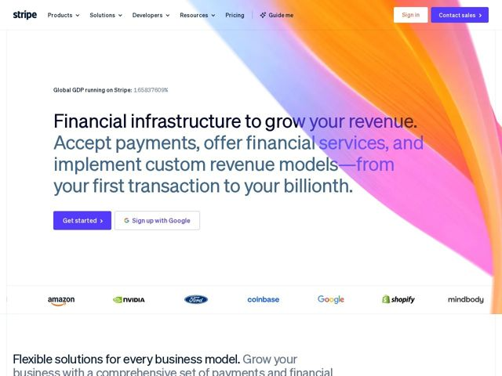

# Stripe — https://stripe.com

- **niche:** fintech
- **mood:** clean-light
- **style:** gradient, minimal, colorful
- **palette:** bg `#FFFFFF` · ink `#0A2540` · accent `#635BFF` — preenchimento do botão de CTA principal 'Get started' e do botão 'Contact sales' na nav; a segunda linha do título do hero é composta num azul-ardósia suave (#425466) em vez do roxo — o verdadeiro acento visual é a faixa de gradiente no canto (laranja-para-magenta-para-pervinca) sangrando a partir do topo direito
- **type:** display *sohne / a sans custom da Stripe (sans-serif humanista geométrica, muito próxima da Söhne/Sohne da Klim)* · body *sohne / fallback sans do sistema (-apple-system, BlinkMacSystemFont, Segoe UI)* — Confiante, apertada, espaçamento entre letras quase zero; grande peso óptico com traços de baixo contraste; lê-se calculada e precisa, não calorosa
- **sections:** hero › logos › feature-payments › feature-billing › feature-agentic-commerce › feature-card-issuing › feature-money-movement › feature-platform-embed › feature-enterprise › testimonials › feature-startups › feature-saas-platform › how-it-works › pricing › testimonials › blog-news › cta › footer
- **signature:** A única faixa de gradiente superdimensionada que entra apenas pelo canto superior direito — uma varredura diagonal esfumada de laranja→magenta→pervinca posta sobre uma tela puramente branca, de modo que 80% do hero permanece vazio e editorial enquanto um canto faz todo o trabalho emocional. Jogada bônus: um contador ao vivo na sobrancelha ('Global GDP running on Stripe: 1.65837609%') marcando casas decimais reais.
- **imagery:** Gradient-mesh como o hero do hero. Uma única varredura de gradiente fluido/seda de alta fidelidade e levemente desfocada usada como motivo de canto em vez de fundo full-bleed. Sem capturas de tela de produto, fotografia ou ilustração no hero. Logos de clientes renderizados em suas cores reais de marca sobre branco (Amazon, NVIDIA, Ford, Coinbase, Google, Shopify, Mindbody). As seções seguintes se apoiam em capturas de produto e UI de código/API conforme os títulos de recurso.
- **copy:** Infraestrutura-como-promessa declarativa, e então imediatamente concreta: o hero diz 'Financial infrastructure to grow your revenue. Accept payments, offer financial services, and implement custom revenue models—from your first transaction to your billionth.' — frase nominal abstrata + lista de capacidades direta, voz calma, técnica e discretamente grandiosa.

**Takeaways (roube como ideias, não copie):**
- Confine a cor a um único canto: um palco puramente branco com uma única faixa de gradiente esfumada sangrando a partir do topo direito lê-se mais rica do que um fundo de gradiente inteiro, e mantém o contraste do título à prova de balas.
- Use dois tons no título: componha a linha da promessa em tinta quase preta e a oração de apoio num ardósia suave para que um H1 longo de múltiplas linhas ainda tenha hierarquia sem mudar de tamanho.
- Combine o CTA com um botão de baixa fricção 'Sign up with Google' ao lado do roxo da marca como principal — dá a um público enterprise um caminho de início instantâneo ao lado de 'Get started'.
- Coloque um flex de credibilidade na minúscula sobrancelha acima do H1 (um contador decimal ao vivo como 'Global GDP running on Stripe: 1.658%') — quantificado, estranhamente preciso e animado para sugerir escala em tempo real.
- Rode os logos de clientes em cor de marca plena sobre branco em vez de acinzentados — no patamar de logos da Stripe, a cor se lê como 'essas marcas nos escolheram', não como ruído visual.
