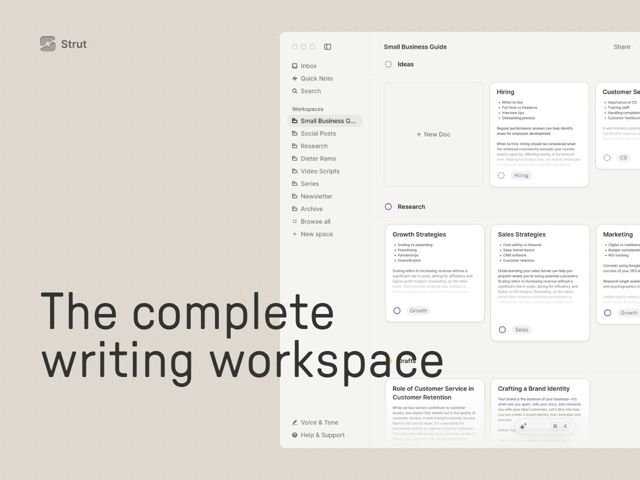

# Strut — https://strut.so

- **niche:** productivity
- **mood:** editorial-minimal
- **style:** minimal, mono-type, photographic
- **palette:** bg `#DED7CC` · ink `#2B2B2B` · accent `#7C5CC4` — pequenos pontos de status e pílulas de tag dentro da UI do produto (roxo/laranja) — a tela bege quente é a verdadeira cor da marca, não o acento
- **type:** display *grotesca monoespaçada (família IBM Plex Mono / Space Mono — letras de largura fixa com terminais em slab)* · body *grotesca sans neutra (tipo sistema/Inter) dentro das capturas da UI do produto* — De escritor e analógica — o título display monoespaçado evoca uma máquina de escrever e um editor de código ao mesmo tempo, sinalizando 'para quem realmente escreve'
- **sections:** hero › feature-focused-writing › feature-write-first-organize-later › feature-ai-collaborator › feature-editing › feature-tools-grid › cta › footer
- **signature:** Um título gigante monoespaçado composto sobre uma tela de papel bege-massa quente, com a janela do app ao vivo sangrando para fora da borda direita de modo que o produto literalmente sobrepõe o tipo — a página se lê como a margem de um manuscrito, não como o típico hero de SaaS branco-brilhante.
- **imagery:** Capturas de tela de alta fidelidade e pixel-reais do app de escrita de verdade (workspaces na barra lateral, docs em grade de cartões, barra de comandos de IA) mostradas superdimensionadas e recortadas na borda da viewport em vez de enquadradas num mockup de navegador arrumadinho. A UI é a única imagem — sem ilustração, sem fotografia de banco de imagens, sem 3D.
- **copy:** Promessas de produto diretas e declarativas numa voz confiante de maker; o hero diz "The complete writing workspace" com batidas de seção em staccato como "Edit. Focus. Finish."

**Takeaways (roube como ideias, não copie):**
- Substitua o branco clínico por um fundo de papel/massa quente — sinaliza instantaneamente 'ferramenta de escrita' e parece analógico sem qualquer textura ou ilustração.
- Componha o título do hero numa fonte monoespaçada grande para telegrafar ofício/código/máquina de escrever; diferencia do mar de SaaS de produtividade com Inter padrão.
- Faça a UI do produto ao vivo sangrar para fora da borda direita de modo que ela sobreponha o título — o app vira a imagem do hero em vez de um mockup centralizado e embalado a vácuo.
- Use cabeçalhos de seção imperativos e diretos de três palavras ('Edit. Focus. Finish.') como dispositivos de ritmo que espelham o ato de escrever.
