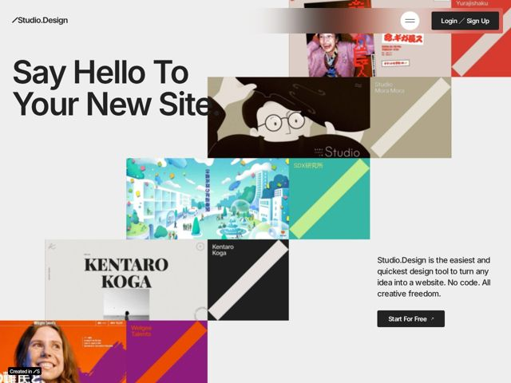

# Studio — https://studio.design

- **niche:** design
- **mood:** bold-loud
- **style:** colorful, bento
- **palette:** bg `#ECECEC` · ink `#1A1A1A` · accent `#E8442C` — Borrowed from the screenshot tiles themselves (the red/orange Japanese site cards and purple Welgee tile) rather than a fixed brand color — the page palette is set by the showcased work; UI chrome stays near-black (Sign Up button, Start For Free CTA) on light gray.
- **type:** display *Helvetica Neue / Akzidenz-style grotesk (heavy weight)* · body *Same neo-grotesque at regular weight* — Swiss, neutral, oversized — lets the colorful tiles carry the loudness while type stays calm and authoritative
- **sections:** hero › logos › feature-showcase › how-it-works › pricing › faq › cta › footer
- **signature:** The hero IS a wall of customer sites — overlapping, color-clashing real screenshots tiled behind the text instead of one polished mockup. The tool proves itself by showing the loud, diverse work it produces, with a small "Created in ⁄S" credit badge stamped on a tile.
- **imagery:** Product-screenshot collage — real customer sites (Japanese editorial pages, illustrated worlds, portfolio layouts) tiled as overlapping cards in a loose, slightly rotated grid. Treatment is "showroom wall": full-bleed thumbnails crammed edge-to-edge as the hero's visual proof, no device frames.
- **copy:** Bold statement headline that talks to the user, not about the product: "Say Hello To Your New Site." — confident, conversational, second-person; subhead reframes the pitch as freedom ("No code. All creative freedom.")

**Takeaways (steal as ideas, don't copy):**
- Let your customers' work be the loud part: keep type and chrome Swiss-neutral on light gray, and source ALL the color from a collage of real product screenshots — the page palette becomes whatever your users made.
- Tile the hero proof as overlapping, slightly-rotated cards that bleed off every edge instead of one centered mockup; it reads as 'endless gallery' and implies scale.
- Pair an oversized neo-grotesque headline (talking TO the user: 'Say Hello To Your New Site.') with a tiny stamped credit badge on a tile ('Created in ⁄S') so the brand signs its own showroom.
- Anchor the conversion column off to one side (subhead + single black 'Start For Free ↗' button) so the visual collage owns the canvas and the CTA reads as a quiet, decisive endpoint.
