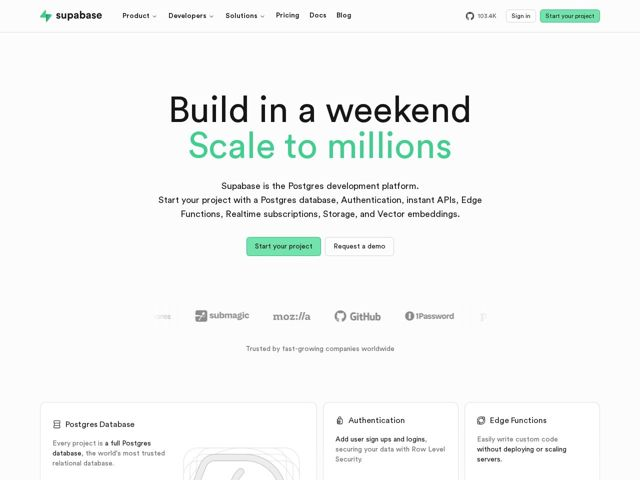

# Supabase — https://supabase.com

- **niche:** dev-tools
- **mood:** clean-light
- **style:** minimal, mono-type, bento
- **palette:** bg `#FFFFFF` · ink `#1C1C1C` · accent `#3ECF8E` — the second hero headline line, primary CTA button fill, logo mark, and small UI affordances
- **type:** display *Custom Sans (Supabase-flavored grotesque, close to a humanist sans)* · body *Same family / system sans* — Engineer-clean and unfussy — wide tracking-free headlines, generous line-height, no decorative weights. Reads like documentation that learned to be confident.
- **sections:** hero › logos › feature-postgres-database › feature-authentication › feature-edge-functions › feature-storage › feature-realtime › feature-vector › feature-data-apis › feature-open-source › how-it-works › cta › footer
- **signature:** Splitting the H1 into two emotional registers via color: "Build in a weekend" in black, "Scale to millions" in the brand green — one headline that performs both the promise and the payoff, with the accent color doing the narrative work instead of decoration.
- **imagery:** Near-zero photography. Faded grayscale customer wordmarks (Mozilla, GitHub, 1Password) in a quiet trust strip, plus monoline outline icons heading each bento feature card. Visual language is restrained line-art and product-dashboard fragments rather than illustration or 3D.
- **copy:** Outcome-first, two-beat value prop in plain dev vernacular — hero: "Build in a weekend / Scale to millions" backed by the flat declarative "Supabase is the Postgres development platform."

**Takeaways (steal as ideas, don't copy):**
- Use ONE accent color as a storytelling device, not paint: color-code a two-line headline so the hue carries the before/after arc.
- Anchor a buzzy promise to a concrete, trusted noun — leading with 'Postgres' instead of vague 'backend' makes the audacious 'scale to millions' feel earned.
- Bento grid of one-feature-per-card (Database, Auth, Edge Functions, Storage, Realtime, Vector) lets a broad platform feel modular and scannable instead of bloated.
- Keep the canvas aggressively white and let monoline icons + faded logos do all the texturing — restraint reads as engineering confidence in dev-tools.
