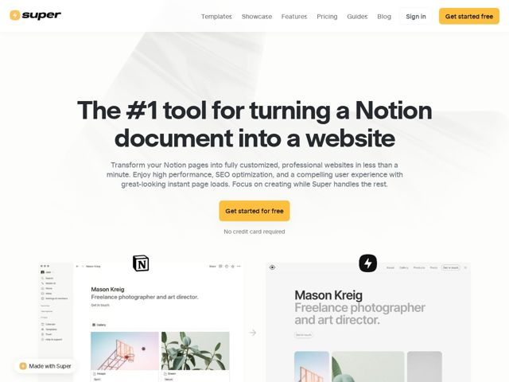

# Super — https://super.so

- **niche:** dev-tools / no-code website builder (Notion-to-site)
- **mood:** clean-light
- **style:** minimal, mono-type, photographic
- **palette:** bg `#FFFFFF` · ink `#2E2E33` · accent `#FBB034` — Primary CTA button fill (Get started free / Get started for free), the lightning-bolt logo mark, and the 'Made with Super' floating badge
- **type:** display *Heavy grotesque sans (rounded geometric, likely a custom/Gilroy-Poppins-style bold)* · body *Neutral humanist sans (system-ui / Inter-like)* — Friendly-confident: a chunky rounded headline weight that feels approachable and toy-like, paired with quiet utilitarian body text so the voice stays warm but not childish
- **sections:** hero › how-it-works › logos › feature-content-in-notion › feature-branding › feature-performance › feature-seo › feature-templates › feature-capabilities › showcase › testimonial-meta › support › cta › faq › footer
- **signature:** The hero's main visual IS the product demo: a literal side-by-side of the raw Notion editor (left) and the polished published website (right) of the same page, joined by an arrow — the before/after transformation is the hero image instead of an abstract dashboard mockup.
- **imagery:** Realistic flat browser/app screenshots rendered with subtle drop shadows on pure white, showing real Notion UI chrome (sidebar, page icons) transforming into a styled site. A faint diagonal architectural photo ghosts behind the hero headline at very low opacity for texture. No 3D, no illustration, no gradients — just honest product UI as proof.
- **copy:** Bold claim-first, plain-spoken: headline "The #1 tool for turning a Notion document into a website" with a reassuring "No credit card required" microcopy under the CTA.

**Takeaways (steal as ideas, don't copy):**
- Make the hero image the literal before/after of your product's core transformation, joined by a connecting arrow — show the input and the output of the same artifact side by side instead of a generic dashboard.
- Pair a chunky rounded ultra-bold display headline with totally neutral body text: the personality lives entirely in one heavyweight typeface, keeping the rest quiet.
- Use a single warm amber accent (#FBB034) reserved only for the logo, primary CTA, and a watermark badge — everything else stays black-on-white so the accent reads as the brand instant.
- Ship a persistent 'Made with Super' badge in the corner as both proof and viral loop — turn the page itself into a self-referential demo of the product.
