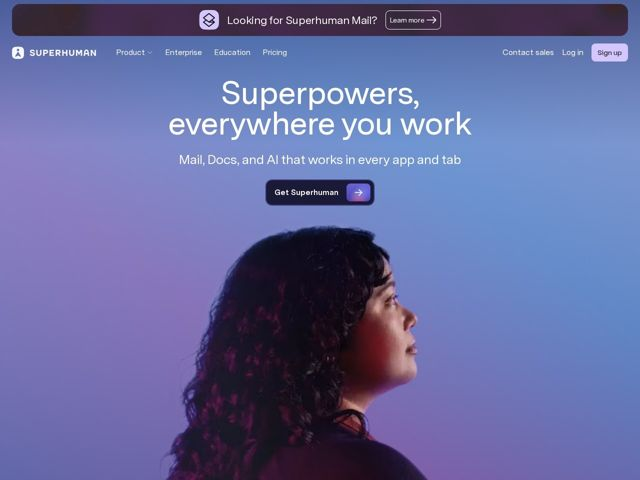

# Superhuman — https://superhuman.com

- **niche:** productivity
- **mood:** premium-luxe
- **style:** gradient, photographic, dark
- **palette:** bg `#6E6E9E` · ink `#FFFFFF` · accent `#A78BFA` — Sign-up pill (lavender), the arrow chip inside the dark glass CTA, and brand-purple lighting on the portrait; otherwise restrained
- **type:** display *GT Pressura-style condensed grotesque (tall, narrow, slightly mono-flavored)* · body *Same condensed sans family, lighter weight* — Tall, tight, mechanical-precise — editorial but engineered, feels like a tool not a brochure
- **sections:** hero › feature-suite-overview › feature-mail › feature-grammarly › feature-coda › feature-go › feature-mail-detail › feature-grammarly-detail › feature-coda-detail › feature-cross-app-ai › how-it-works › cta › footer
- **signature:** The whole page floats inside one continuous twilight gradient-mesh that the hero portrait is literally lit by — purple/blue rim light on the face matches the background, so subject and canvas are one atmosphere rather than a photo pasted on a color.
- **imagery:** Photography-led: a single backlit human portrait (profile, looking up) bleeding into a full-bleed gradient-mesh sky. Product UI appears in later feature blocks; the hero is aspirational human, not a screenshot.
- **copy:** Capability-as-superpower flex. Hero: "Superpowers, everywhere you work" with sub "Mail, Docs, and AI that works in every app and tab" — confident, ambient, benefit-over-feature voice.

**Takeaways (steal as ideas, don't copy):**
- Light your hero subject with your accent color so the photograph and the gradient background share one light source — the image dissolves into the canvas instead of sitting in a box.
- Build the primary CTA as a dark glass pill with a separate bright accent arrow-chip riveted to the right edge — the chip carries the color so the button stays calm.
- Use a tall condensed grotesque at huge size for a two-line hero; the narrow letterforms let a long phrase fill the width and read as 'engineered' rather than decorative.
- Frame a multi-product suite as named superpowers (Mail, Docs, AI, cross-app) under one aspirational umbrella line, so a bundle reads as a single capability instead of a feature list.
