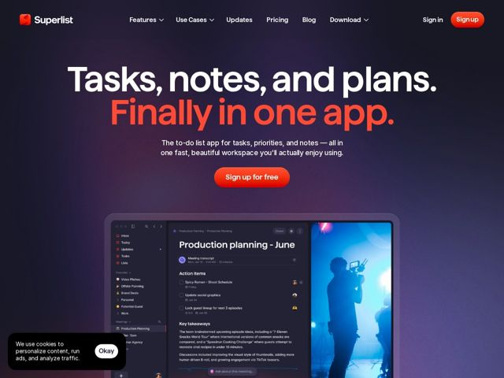

# Superlist — https://superlist.com

- **niche:** productivity
- **mood:** technical-dark
- **style:** dark, gradient, bold, cinematic
- **palette:** bg `#1A1326` · ink `#FFFFFF` · accent `#FF3D24` — segunda linha do headline, pílulas de CTA principal (Sign up / Sign up for free), marca do logo e pequenos pontos de status na UI do produto
- **type:** display *Sans grotesca geométrica (peso heavy/black, tracking bem apertado) — lê-se como uma face custom ou no estilo Aeonik/Sharp-Grotesk* · body *Sans humanista limpa (peso regular) para subtítulo e rótulos de UI* — Alto e confiante no topo, calmo e utilitário no produto — a tipografia faz o grito para que a UI possa ficar quieta
- **sections:** hero › feature-everyday-superpowers › feature-meeting-notes-ai › feature-recurring-tasks › feature-heatmaps-previews › problem-stop-juggling-apps › cta-balance › footer
- **signature:** O headline do hero é dividido em duas cores empilhadas como uma única declaração superdimensionada — a linha um em branco, a linha dois ("Finally in one app.") em vermelho vívido — transformando a proposta de valor num trocadilho tipográfico em vez de decorá-la com uma ilustração. Tipografia massiva em peso black com tracking negativo-apertado preenche a largura total, o que rompe a convenção educada e amigável-pastel do nicho de to-do/produtividade.
- **imagery:** Um único screenshot de produto grande e realista flutuando no hero escuro — um workspace real do Superlist (quadro Production Planning com itens de ação, transcrição de reunião por IA e uma miniatura fotográfica embutida de uma gravação de vídeo). A UI é mostrada em fidelidade quase nativa com uma perspectiva/brilho sutil, sobre um gradiente radial profundo de berinjela-para-magenta que faz o cartão branco do app saltar. Linguagem de imagem = mostre o produto real, sem 3D abstrato ou mascotes.
- **copy:** Direto-ao-ponto mas com impacto: uma lista factual e plana ("Tasks, notes, and plans.") resolvida por um arremate vermelho desafiador — o hero diz "Tasks, notes, and plans. Finally in one app."

**Takeaways (roube como ideias, não copie):**
- Headline em dois tons: mantenha a linha um neutra/branca e jogue o desfecho emocional numa segunda linha na sua única cor de acento — a cor faz a persuasão.
- Use um único vermelho saturado como todo o sistema de acento (headline, CTA, logo, micro-pontos de status) contra um gradiente atmosférico para que cada elemento interativo se leia como 'a mesma ação'.
- Deixe uma grotesca peso black superdimensionada em sangria total carregar o hero, depois fique deliberadamente quieto e utilitário dentro do screenshot do produto para contraste.
- Ancore um hero escuro e dramático com uma única foto real do produto em alta fidelidade (incluindo um elemento fotográfico dentro da UI) em vez de arte abstrata — isso prova que o app é real sem uma seção de demo separada.
