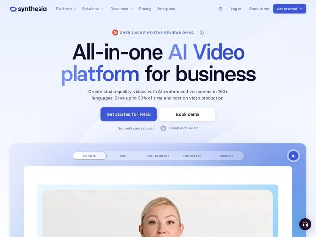

# Synthesia — https://synthesia.io

- **niche:** ai-video
- **mood:** clean-light
- **style:** gradient, minimal, colorful
- **palette:** bg `#EEF1FB` · ink `#1B1F3B` · accent `#5B5BF0` — Metade do headline do hero ('AI Video platform') em índigo, preenchimento do botão de CTA principal, o rótulo da aba segmentada ativa e a moldura da UI ao vivo do produto
- **type:** display *Basier Square (grotesca geométrica)* · body *Basier Square* — Uma única grotesca geométrica e cálida usada em tudo; terminais arredondados e uma altura-x alta mantêm o hero gigante acessível em vez de corporativo-frio
- **sections:** hero › feature-tabs (create/edit/collaborate/translate/publish) › problem (Fortune 100 framing) › feature-grid (avatar, instant-video, collab, translate, screen-rec, player, brand, one-click-update, SCORM, analytics) › interactive-demo (free AI video tool) › testimonials (loved by users / legal / CFO) › trust (SOC2, GDPR, ISO42001, SAML/SSO) › resources (academy, community, services) › faq › cta › footer
- **signature:** Uma superfície de produto ao vivo e alternável fica logo abaixo do hero: abas segmentadas Create/Edit/Collaborate/Translate/Publish com um toggle de mudo funcional conduzem uma prévia real de avatar de IA — a página demonstra o produto no próprio lugar em vez de mostrar um screenshot estático no hero.
- **imagery:** Quadros reais de vídeo de avatar de IA (o rosto de um apresentador) embutidos dentro de um mockup de dispositivo azul suave e em camadas, com cantos arredondados e bordas tingidas; chips de UI flutuantes e uma varredura de gradiente translúcida atrás de tudo mantêm a cena leve e arejada, não um screenshot de dashboard plano.
- **copy:** B2B confiante, conduzido pelo benefício e com números concretos — hero: 'All-in-one AI Video platform for business' respaldado por 'Save up to 90% of time and cost' e um selo de avaliação G2.

**Takeaways (roube como ideias, não copie):**
- Headline em dois tons: mantenha o sintagma nominal em tinta e colora apenas a categoria do produto ('AI Video platform') para marcar as próprias palavras
- Substitua o screenshot estático do hero por uma demo ao vivo com abas (Create/Edit/Translate...) para que os visitantes percorram mentalmente o fluxo antes de rolar
- Empilhe a prova social como um sanduíche: selo G2 acima do headline, micro-prova 'No credit card required + 4.7/5' sob os CTAs
- Enquadre confiança para três personas de comprador em uma linha ('Loved by users. Approved by legal. Signed off by CFOs') e respalde com uma fileira de conformidade (SOC2/GDPR/ISO42001)
