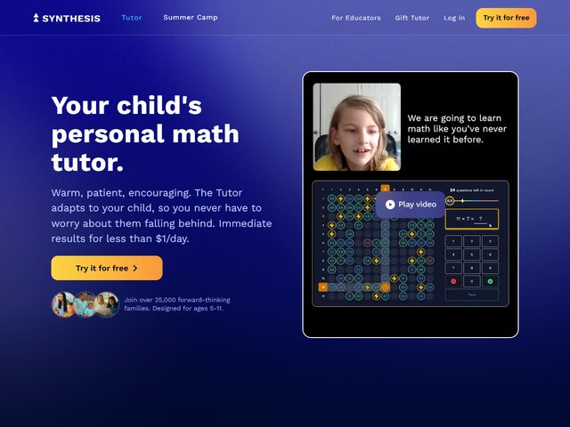

# Synthesis — https://www.synthesis.com

- **niche:** education
- **mood:** bold-loud
- **style:** vivid, gradient, product-ui, friendly
- **palette:** bg `#1E2A8C`→`#27144E` · ink `#FFFFFF` · accent `#F5B127` — Um âmbar/dourado cálido que faz dupla função: é a pílula de CTA principal ("Try it for free") E as fichas de jogo ao vivo dentro do screenshot do produto, então a cor de marketing e a cor in-app são deliberadamente a mesma. O corpo de texto cai para um suave periwinkle (`#A9B4E8`) contra o azul profundo.
- **type:** display *grotesca geométrica, peso heavy, set apertado — pense em Aktiv Grotesk / Söhne Kräftig* · body *sans humanista neutra (Inter / sistema)* — Confiante e parental-mas-divertida; o headline é setado grande e em negrito como uma promessa, não como um livro didático.
- **sections:** hero › how-it-works (adaptive tutor) › subjects-and-ages › parent-testimonials › pricing › cta › footer
- **signature:** A dobra é dividida: uma promessa de texto plana e superdimensionada à esquerda, e à direita um mock de "dispositivo" empilhado e brilhante que sobrepõe um vídeo real de talking-head de uma criança ("We are going to learn math like you've never learned it before.") diretamente sobre um screenshot ao vivo do tabuleiro de jogo do produto real — grade de multiplicação, teclado numérico, prompt "11 × 7 = ?", "24 questions left in round". Uma pílula de Play-video faz a ponte entre os dois. Ela vende o desfecho emocional (uma criança feliz e engajada) e a UI literal do produto numa única pilha composta.
- **imagery:** Híbrida: still de vídeo espontâneo de criança (cálido, real, não polido como banco de imagens) fundido a um screenshot de UI de produto em estilo de jogo, renderizado em âmbar-escuro-sobre-marinho. Mais um pequeno aglomerado de avatares de família arredondados ao lado da linha de prova social. Sem ilustração, sem 3D abstrato — apenas criança real + app real.
- **copy:** Cálida, tranquilizadora, voltada aos pais. Headline: "Your child's personal math tutor." Subtítulo: "Warm, patient, encouraging. The Tutor adapts to your child, so you never have to worry about them falling behind. Immediate results for less than $1/day." Prova social: "Join over 25,000 forward-thinking families. Designed for ages 5-11."

**Takeaways (roube como ideias, não copie):**
- Unifique o acento de marketing com o acento in-product — o mesmo dourado no CTA e nas fichas de jogo faz o botão parecer uma peça do produto, não um anúncio.
- Empilhe dois tipos de prova num único visual de hero: um still de vídeo emocional de um usuário real sobre um screenshot literal da UI funcionando, com um botão de Play fazendo a ponte.
- Antecipe o medo real do comprador no subtítulo ("never have to worry about them falling behind") e desarme o preço logo de cara ("less than $1/day").
- Fixe um número preciso na prova social ("25,000 forward-thinking families", "ages 5-11") com um pequeno aglomerado de avatares em vez de um vago "confiado por milhares".
