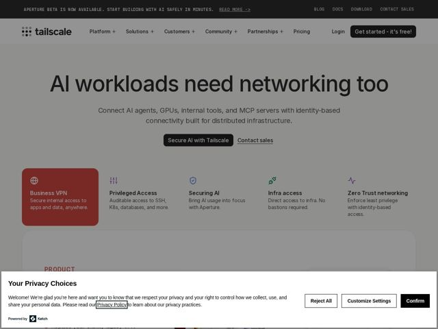

# Tailscale — https://tailscale.com

- **niche:** dev-tools / infra (networking, zero-trust connectivity)
- **mood:** clean-light
- **style:** minimal, mono-type, bento
- **palette:** bg `#F5F4F2` · ink `#1B1B1B` · accent `#A6402E` — Single highlighted feature card (terracotta/brick-red fill with white text), section eyebrow labels ('PRODUCT'), and link underlines — used surgically, one block at a time, never as a wash
- **type:** display *Geometric grotesque sans (Tailscale's custom/near-Inter display cut), tight tracking, lowercase-friendly* · body *Same humanist grotesque at regular weight; monospaced/letter-spaced caps for eyebrows, nav utilities, and the top announcement bar* — Engineer-calm and matter-of-fact — oversized lowercase headline meets terminal-style spaced-out monocaps; confident without shouting
- **sections:** announcement-bar › nav › hero › feature-grid › logos › feature-deep-dive › how-it-works › testimonials › cta › footer
- **signature:** The hero is just centered black text on near-white paper — no product screenshot, no gradient, no 3D mesh, no glowing globe. In a category obsessed with network-topology dataviz and dark dashboards, Tailscale leads with confident typographic restraint and lets a SINGLE terracotta card be the only color on the entire fold.
- **imagery:** Near-imageless above the fold. Iconography is thin-line monochrome glyphs (globe, shield, link, pulse) sitting above short feature labels. The one piece of 'imagery' is color-as-object: one feature card painted solid brick-red to act as the visual anchor instead of a photo or illustration.
- **copy:** Plainspoken engineer voice, headline states a need as fact — live hero: "AI workloads need networking too" (canonical h1: "The best secure connectivity platform for the AI era"); subhead lists concrete nouns: "Connect AI agents, GPUs, internal tools, and MCP servers."

**Takeaways (steal as ideas, don't copy):**
- Anchor a colorless layout with ONE saturated card — make a single feature tile a solid brand-color block so it reads as the hero element without needing a product shot.
- Set eyebrows, nav, and the top promo bar in letter-spaced ALL-CAPS monospace to signal 'engineering tool' while keeping the headline a soft oversized lowercase — the contrast does the branding.
- Lead a hyped category (AI infra) with typographic confidence on paper-white, not a dark dashboard — restraint reads as senior/credible against gradient-heavy competitors.
- Sub-headline by enumerating real nouns the user has (GPUs, MCP servers, internal tools) instead of abstract benefit-speak — specificity signals the product actually fits their stack.
