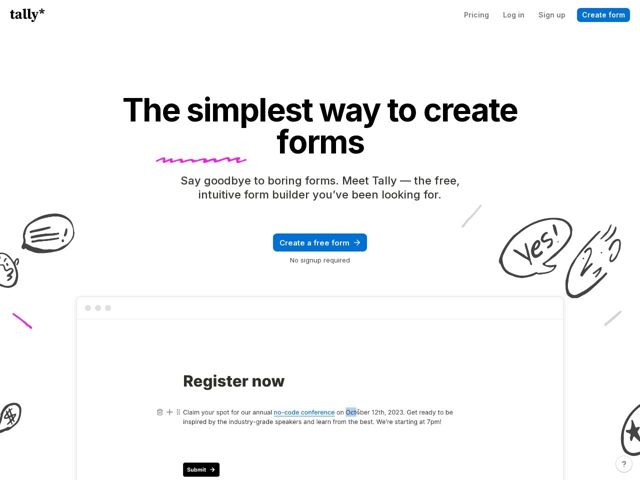

# Tally — https://tally.so

- **niche:** productivity
- **mood:** warm-playful
- **style:** minimal, illustrated, colorful
- **palette:** bg `#FFFFFF` · ink `#0A0A0A` · accent `#3B7BF6` — Botões de CTA principal (Create form, Create a free form) e links de texto inline dentro do formulário de demo; um magenta-quente secundário (#FF1FB6) aparece como um sublinhado de rabisco desenhado à mão e acentos de doodle
- **type:** display *Inter (peso heavy/black, tracking apertado)* · body *Inter (regular)* — Grotesca geométrica setada ultra-bold e superdimensionada para o headline, depois quieta e neutra no corpo — o contraste de peso faz todo o grito enquanto a própria fonte permanece sóbria e suíça
- **sections:** hero › feature-form-builder › feature-simple-powerful › feature-intelligent-logic › feature-customize › feature-share › feature-integrations › feature-personas › cta › faq › footer
- **signature:** O hero faz flutuar doodles de marcador feitos à mão livre — um balão de fala rabiscado, um 'Yes!' desenhado à mão, estrelas, setas, um sublinhado de rabisco em magenta-quente — espalhados soltos nas margens brancas em torno de um headline austero preto-no-branco. Um construtor de formulários (uma categoria que grita SaaS corporativo estéril) em vez disso se apresenta como um caderno em que alguém rabiscou.
- **imagery:** Sem fotografia e sem 3D polido. Dois registros visuais colidem: (1) doodles de tinta preta-suave soltos (balões de fala, estrelas, setas, rabiscos) espalhados à mão no espaço em branco, e (2) um mockup de produto ao vivo, pixel-perfeito, emoldurado numa moldura de navegador falsa (pontos de farol) mostrando um formulário real 'Register now' em meio à edição, com alças de arraste e ícones de barra de ferramentas visíveis — vendendo o produto de forma literal em vez de abstrata.
- **copy:** Direta, confiante, anti-corporativa — vende simplicidade sendo simples. Hero: 'The simplest way to create forms' com sub 'Say goodbye to boring forms. Meet Tally — the free, intuitive form builder you've been looking for.'

**Takeaways (roube como ideias, não copie):**
- Desarme uma categoria estéril com marginália desenhada à mão: mantenha o sistema tipográfico rigorosamente limpo e suíço, depois deixe doodles de tinta imperfeitos no espaço negativo carregarem toda a personalidade e o calor.
- Use um único sublinhado de rabisco magenta-quente como a única explosão de cor saturada sob um headline todo preto — um acento, posicionado uma vez, se lê mais ousado que uma paleta de cores completa.
- Coloque a UI real do produto no hero, em meio à edição com alças de arraste e moldura de barra de ferramentas visíveis, em vez de um gráfico abstrato vago — mostre o verbo que o produto faz.
- Empilhe uma micro-linha mata-fricção ('No signup required') diretamente sob o CTA para converter a promessa de simplicidade numa ação imediata e de baixo compromisso.
