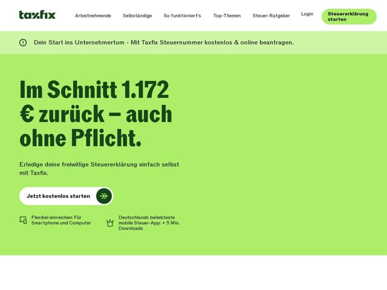

# Taxfix — https://taxfix.de

- **niche:** fintech
- **mood:** bold-loud
- **style:** colorful, mono-type, minimal
- **palette:** bg `#9BE564` · ink `#1B4D1B` · accent `#1B6B2E` — dark-green pill CTA, the white primary button's circular arrow node, logo, and all body/heading ink that reverses out of the lime field
- **type:** display *Grotesque slab/serif-inflected sans (heavy condensed display, ITC-Tiffany-meets-grotesk feel)* · body *Humanist sans-serif* — Loud, friendly, confidently German — oversized numeric-led headline with a tightly-set slabby display face that feels editorial rather than corporate-fintech
- **sections:** hero › feature-why-it-fits › feature-deadline-reminder › feature-supported-cases › pricing › feature-made-for-you › problem-vs-free-alternative › testimonials › feature-prepare-save › logos-awards › feature-self-serve › faq › related-content › footer
- **signature:** A full-bleed acid-lime canvas owns the entire hero — instead of the usual fintech navy/white trust palette, it reverses dark-forest-green type out of a saturated chartreuse field, making a tax app feel like a sneaker drop.
- **imagery:** Almost no photography in the hero — it's pure color-block typography. Iconography is minimal monoline (computer, crown) sitting as quiet trust-stat markers beneath the CTA. The visual weight is carried entirely by the giant euro-figure headline, not imagery.
- **copy:** Number-first, refund-led promise in plain conversational German; hero headline: "Im Schnitt 1.172 € zurück – auch ohne Pflicht."

**Takeaways (steal as ideas, don't copy):**
- Lead the hero with the single most persuasive NUMBER set in display-scale type (the euro refund figure IS the headline) rather than a benefit slogan.
- Commit to one saturated brand color as a full-bleed field and reverse dark same-hue ink out of it — monochromatic-green confidence instead of accent-on-white.
- Pair a white pill CTA with a contrasting filled circular arrow node, and a thin top announcement bar in a lighter tint of the same hue for layered-but-cohesive color.
- Use a heavy slabby/grotesque display face to give a dry category (tax filing) editorial, almost magazine-cover swagger.
