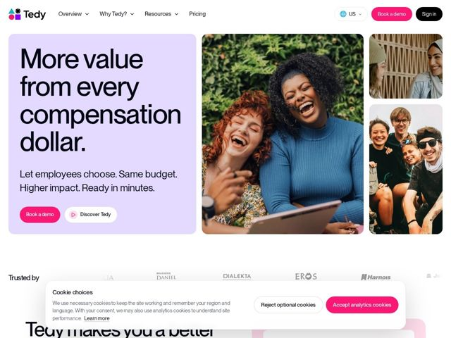

# Tedy — https://tedy.app

- **niche:** hr-tech (employee benefits / compensation & rewards platform)
- **mood:** warm-playful
- **style:** colorful, photographic, bento
- **palette:** bg `#FFFFFF` · ink `#111111` · accent `#EC2D7A` — Botões de CTA principal (Book a demo, pílula de Sign in, aceite de cookies), ponto da marca, pequeno glifo de botão de play
- **type:** display *Sans grotesca geométrica (estilo DM Sans / Hanken Grotesk), peso heavy* · body *Mesma família, peso regular* — Grotesca amigável de terminais arredondados, setada extra-bold e apertada — confiante e acessível, não corporativa-rígida
- **sections:** hero › logos › feature-intro
- **signature:** Um cartão arredondado em lilás-pastel como a metade esquerda do hero, emparelhado com uma grade bento de fotos reais de pessoas rindo, espontâneas, à direita — a página lidera com alegria humana em vez do screenshot-de-dashboard-no-escuro que domina o SaaS de RH/remuneração.
- **imagery:** Fotografia de estilo de vida autêntica e cálida, de pessoas reais e diversas em pleno riso, arranjadas numa grade bento arredondada de tamanhos variados (uma grande foto vertical de hero mais dois quadros menores empilhados). Sem screenshots de UI de produto à vista; os logos na faixa de confiança estão em escala de cinza esmaecida.
- **copy:** Reivindicação de valor conduzida pelo benefício, direta — headline do hero "More value from every compensation dollar." com um subtítulo staccato e impactante "Let employees choose. Same budget. Higher impact. Ready in minutes."

**Takeaways (roube como ideias, não copie):**
- Emparelhe um headline superdimensionado extra-bold contra um cartão pastel suave, depois equilibre com fotografia humana real numa grade bento — calor em vez de um screenshot escuro de produto.
- Use subtítulos em fragmentos staccato ('Same budget. Higher impact. Ready in minutes.') para comprimir o discurso em batidas rítmicas e escaneáveis.
- Ancore a marca num único acento magenta-rosa-quente usado com parcimônia nos CTAs e no ponto do logo, para que salte contra um campo neutro branco/lilás.
- Misture um CTA principal sólido em formato de pílula com um secundário de contorno branco que carrega um pequeno glifo de play em acento — hierarquia clara sem uma segunda cor barulhenta.
