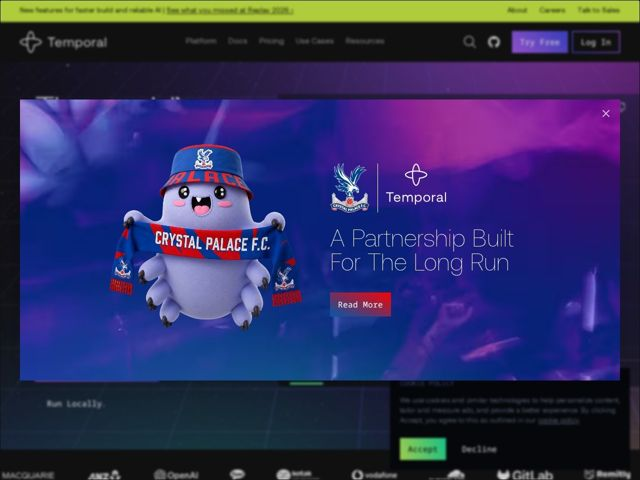

# Temporal — https://temporal.io

- **niche:** dev-tools
- **mood:** technical-dark
- **style:** dark, gradient, mono-type, 3d
- **palette:** bg `#1A0B2E` · ink `#F4F1FA` · accent `#7B61FF` — Botão de CTA principal 'Try Free', lavagens de gradiente roxo-elétrico pelo fundo do hero, estados de link/hover, e uma barra de anúncio verde-lima mais uma linha de acento verde como segundo pop
- **type:** display *Sans geométrica/grotesca para o H1 ('The world's best AI runs on Temporal')* · body *Monoespaçada para nav, rótulos estilo código ('Run Locally.') e chamadas de terminal* — Nativo-de-engenheiro: a moldura de UI monoespaçada sinaliza 'isto foi feito por gente que vive num terminal', enquanto a sans display arredondada o mantém acessível em vez de frio
- **sections:** announcement-bar › hero › logos › feature-write-code-as-if-failure-doesnt-exist › feature-demo (see it to believe it) › feature-sdks › feature-workflows › feature-activities › feature-state-machines › feature-visibility › feature-open-source › feature-battle-tested › feature-hosting-paths › cta › footer
- **signature:** Um mascote-blob 3D amigável (aqui co-branded com um cachecol do Crystal Palace FC) injetado num produto de sistemas distribuídos sério e escuro — ferramentas de infra quase nunca lançam um personagem fofo, e a Temporal abraça isso como personalidade de marca, chegando a manter uma parceria real com um clube de futebol.
- **imagery:** Mascote personagem renderizado em 3D com iluminação de estúdio suave contra ambientes de gradiente roxo/magenta profundo; trechos de código estilo terminal e rótulos mono usados como elementos gráficos; linhas de grade isométrica tênues no fundo escuro para uma textura de 'diagrama de sistemas'; logos de clientes em escala de cinza para a faixa de confiança.
- **copy:** Voz ousada, de confiança-como-afirmação, que promete o impossível e depois explica — hero: "The world's best AI runs on Temporal", reforçado por "Write code as if failure doesn't exist" e "Build invincible apps".

**Takeaways (roube como ideias, não copie):**
- Ancore uma marca de dev-infra numa única promessa que soa impossível ('failure doesn't exist') e deixe cada título de seção reafirmá-la de um novo ângulo (workflows, activities, state machines, visibility).
- Misture uma monoespaçada para moldura/rótulos de UI com uma sans display arredondada para headlines — o contraste se lê instantaneamente como 'ferramenta séria, time humano'.
- Dê a um produto de infra sério um mascote 3D recorrente e deixe-o carregar o calor da marca (e até co-branding de patrocínio) onde os concorrentes só mostram diagramas.
- Combine um gradiente roxo-magenta profundo com uma única e contrastante barra de acento verde-lima para que anúncios e CTAs-chave saltem contra o campo escuro sem adicionar bagunça à paleta.
