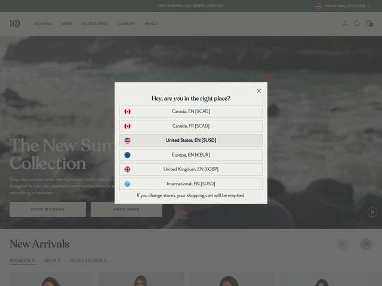

# tentree — https://www.tentree.com

- **niche:** nature
- **mood:** editorial-minimal
- **style:** photographic, minimal, editorial, earthy
- **palette:** bg `#0A1418` · ink `#F4F2EC` · accent `#3E5C4B` — There is almost no chromatic accent in the hero itself; the "accent" is the muted coastal sage-green pulled straight from the photograph (water, foliage, the small "10" logo mark), so the brand color reads as *nature itself* rather than a painted UI swatch.
- **type:** display *high-contrast editorial serif, Canela / Tiempos Headline feel* · body *humanist sans, Founders Grotesk / Neue Haas Grotesk* — Calm, premium-outdoors voice; the serif headline does the emotion, the small sans does the wayfinding.
- **sections:** hero › new-arrivals-grid › shop-by-category (womens/mens/accessories) › impact-trees-planted-counter › climate-plus-membership › lookbook-editorial › reviews › cta › footer
- **signature:** The hero is a full-bleed, desaturated *moody coastal photograph* (figure on a rocky shoreline, overcast surf) with the serif headline set bottom-left in the lower third — editorial magazine-cover composition, not e-commerce hero. The most distinctive on-load move is a centered region/currency modal ("Hey, are you in the right place?") that gates entry with flag-tagged store options (Canada, US, Europe, UK, International), turning localization into the first brand impression. A circular pause-control bottom-right reveals the hero is actually playing as muted video.
- **imagery:** Photographic and cinematic — real human on a real beach in flat overcast light, low saturation, cool blue-grey grade so the apparel and landscape blend into one calm palette. No product cut-outs, no 3D, no illustration in the fold; the lifestyle film *is* the product shot.
- **copy:** Quiet, seasonal, retail-editorial. Headline: "The New Summer Collection". Subhead: "Step into summer with new styles and fresh colours—designed to take you anywhere from sunrise hikes to everything in between." Dual CTAs "SHOP WOMENS" / "SHOP MENS" in small-caps tracked sans. Modal eyebrow copy: "Hey, are you in the right place?" with the caution line "If you change stores, your shopping cart will be emptied."

**Takeaways (steal as ideas, don't copy):**
- Let the brand accent *come out of the photo* instead of being a hex you apply — a graded coastal image means the palette is automatically on-brand and never clashes.
- Compose the hero like a magazine cover: full-bleed cinematic photo, serif headline anchored in the lower-left third, CTAs tucked beneath — reads aspirational, not transactional.
- Use a muted auto-playing video hero with a small circular pause toggle bottom-right, so motion adds life without demanding attention or sound.
- Make localization a deliberate first-touch moment: a flag-tagged "are you in the right place?" modal sets currency/region up front and feels like concierge care rather than a banner nag.
