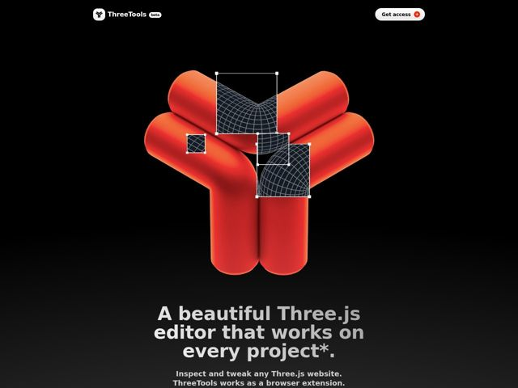

# Three — https://three.tools

- **niche:** dev-tools
- **mood:** technical-dark
- **style:** dark, 3d, minimal, cinematic
- **palette:** bg `#070707` · ink `#E8E8E8` · accent `#F03A1E` — the giant 3D rendered logo sculpture (the hero's entire visual mass), plus the small '+' badge inside the 'Get access' CTA pill
- **type:** display *Geometric grotesque (heavy weight, condensed-ish, likely a custom/Druk- or Inter-Display-adjacent face)* · body *Neutral sans-serif (bold weight for subhead), close to Inter/Helvetica* — Loud, blocky, almost poster-like headlines that feel hand-set; tight, no-nonsense engineering tone underneath
- **sections:** hero › feature-grid › credibility › testimonials › faq › cta › footer
- **signature:** The hero is a single colossal 3D-rendered glossy logomark (an inflated balloon 'Y/three' sculpture) sitting in negative space — with actual Three.js transform gizmos and wireframe-mesh selection boxes overlaid ON the object. The product (a scene inspector) is demonstrated by literally editing its own logo, instead of the usual UI-screenshot-in-a-browser-frame hero that every dev tool ships.
- **imagery:** High-fidelity ray-traced 3D render: soft-body, balloon-like inflated geometry with wet-clay specular highlights in molten orange-red, floating on pure black. Layered with literal editor chrome — dashed selection handles, transform gizmos, and dark wireframe UV-grid panels — so the static image reads as a frozen frame of the tool in use.
- **copy:** Confident, slightly cheeky product voice with an asterisk-as-joke; hero reads "A beautiful Three.js editor that works on every project*." followed by the plain promise "Inspect and tweak any Three.js website."

**Takeaways (steal as ideas, don't copy):**
- Demo the product ON its own brand mark: overlay the actual app's tool chrome (gizmos, selection boxes, wireframes) onto your 3D logo so the hero IS a live usage screenshot, no laptop mockup needed.
- Let one oversized glossy 3D object carry 70% of the viewport on pure black — push the headline far below the fold so the render gets full cinematic breathing room.
- Use a single saturated molten-orange against near-black and nowhere else; the restraint makes the one accent feel like a spotlight rather than decoration.
- Plant a typographic in-joke (the trailing asterisk on 'every project*') to signal a maker-built tool with personality and pre-empt the 'does it really work everywhere?' objection.
