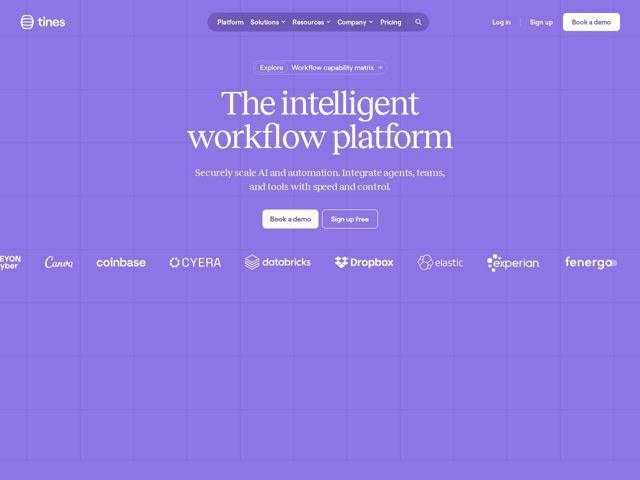

# Tines — https://tines.com

- **niche:** ai
- **mood:** bold-loud
- **style:** mono-type, gradient, minimal, editorial-minimal
- **palette:** bg `#8B7FE8` · ink `#FFFFFF` · accent `#FBF7F0` — Warm off-white/cream fill on the primary 'Book a demo' button and pill CTA; white reserved for the giant serif headline and body text against the all-over violet field
- **type:** display *High-contrast transitional serif (Didone-adjacent, e.g. a Tiempos/Canela-style face) for the oversized italic-free headline* · body *Humanist serif at small size for subhead/body — unusually, body is also serif, not the default sans* — Literary and editorial — reads like a magazine masthead, not a dashboard; confident, calm, premium
- **sections:** hero › logos › feature-time-to-value › feature-interconnected-workflows › how-it-works › feature-security-teams › feature-it-operations › feature-integrations › feature-community › blog › footer
- **signature:** The entire viewport is flooded edge-to-edge in a single saturated periwinkle-violet with a faint graph-paper grid overlay — no white canvas, no product screenshot above the fold. An AI/automation platform that would conventionally lead with a dark technical UI dashboard instead opens like a glossy print magazine cover: one monolithic color, a colossal book-serif headline, zero chrome.
- **imagery:** Almost no photographic or 3D imagery above the fold — the 'image' IS the color field plus a subtle technical grid (nod to canvas/node-graph workflows). Trust is carried entirely by a monochrome logo wall (Canva, Coinbase, Databricks, Dropbox, Elastic, Experian) rendered in flat white/translucent, all tinted into the same violet wash so nothing breaks the single-hue spell.
- **copy:** Plain-spoken authority headline set in giant serif — "The intelligent workflow platform" — with a tight benefit subhead ("Securely scale AI and automation. Integrate agents, teams, and tools with speed and control.")

**Takeaways (steal as ideas, don't copy):**
- Commit fully to ONE saturated hue: flood the whole viewport, tint the logo wall into it, and let the headline be the only contrast — restraint reads as confidence.
- Set a body serif, not just a display serif — an all-serif page in a sans-dominated AI category instantly signals 'premium / editorial' and breaks the dashboard trope.
- Overlay a faint graph-paper grid as ambient texture that quietly references the product (node/workflow canvas) without showing a single screenshot.
- Pair a warm cream CTA button against the cool violet field — a single temperature shift makes the primary action pop harder than any bright accent could.
