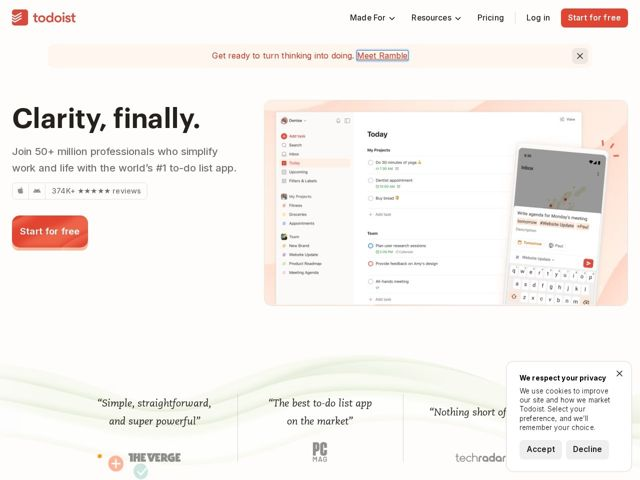

# Todoist — https://todoist.com

- **niche:** productivity
- **mood:** warm-playful
- **style:** minimal, illustrated, photographic
- **palette:** bg `#FFFCF9` · ink `#202020` · accent `#E44332` — símbolo do logo, botões de CTA (Start for free), link inline na barra de anúncios, destaque ativo da navegação/sidebar e o fundo cor de pêssego da foto do produto
- **type:** display *Caecilia (humanist slab serif)* · body *Graphik / Inter (geometric-grotesque sans)* — Autoridade amigável: um título em slab-serif encorpado transmite calor e confiança, enquanto a sans limpa mantém o texto de apoio discreto e legível. As pull-quotes mudam para um serif itálico para um toque editorial e humano.
- **sections:** announcement-bar › hero › logos › feature-templates › feature-trust › feature-calm-clarity › cta › footer
- **signature:** O hero abandona o clichê dos apps de produtividade (listas de recursos e gradientes berrantes) por uma promessa emocional de duas palavras ("Clarity, finally.") composta em um slab serif pesado — vendendo um sentimento, não um recurso, sobre uma tela de papel quente quase branca.
- **imagery:** Screenshots reais da UI do produto flutuando sobre um suave gradiente cor de pêssego, composição em camadas de desktop-mais-celular com discretos confetes/faíscas para encanto. Linhas onduladas orgânicas desenhadas à mão separam a faixa de prova social. Logos de imprensa renderizados em tons de cinza suaves para que o único acento vermelho permaneça dominante.
- **copy:** Promessa emocional e minimalista sobre o jargão de recursos — confiante e calma; o título do hero diz "Clarity, finally." com o subtítulo "Join 50+ million professionals who simplify work and life with the world's #1 to-do list app."

**Takeaways (roube como ideias, não copie):**
- Lidere com um sentimento, não com um recurso: um título de duas palavras em slab-serif que nomeia a recompensa emocional supera uma lista de funcionalidades para um produto maduro e confiável.
- Ancore um fundo de 'papel quente' quase branco (#FFFCF9) com um único acento vermelho saturado para que todo CTA e o símbolo da marca sejam lidos instantaneamente, sem poluição de cores.
- Empilhe um screenshot de desktop com um mockup de celular sobreposto sobre um suave pad de gradiente tingido para mostrar o fluxo entre dispositivos num único olhar.
- Incorpore a confiança quantificada (50M+ de usuários, 374K+ avaliações cinco estrelas, selos das app stores) diretamente abaixo do CTA do hero, em vez de enterrá-la numa faixa de estatísticas separada.
