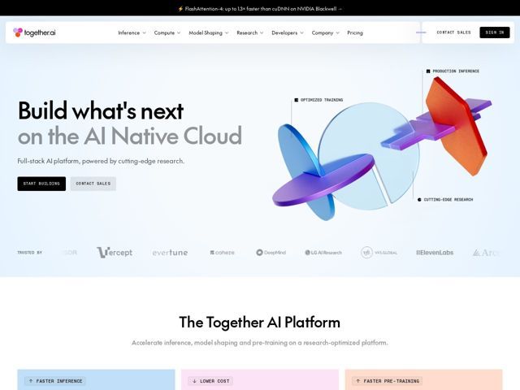

# Together — https://together.ai

- **niche:** ai
- **mood:** clean-light
- **style:** gradient, 3d, mono-type
- **palette:** bg `#FFFFFF` · ink `#0A0A0A` · accent `#7C4DFF` — gradiente iridescente de roxo para laranja na escultura 3D flutuante do hero; tons pastel suaves (azul/rosa/pêssego) como fundos dos cards de recursos; a segunda linha do H1 desbota para um cinza frio
- **type:** display *PP Neue Montreal Mono* · body *PP Neue Montreal Mono* — Uma única grotesque monoespaçada faz todo o trabalho — credibilidade de engenharia, próxima ao terminal, de laboratório de pesquisa, mas composta enorme e apertada lê como editorial confiante, não como algo nerd
- **sections:** announcement-bar › hero › logos › feature-intro › feature-full-stack › feature-research › testimonials › blog-news › cta › footer
- **signature:** Um diagrama explodido literalmente renderizado em 3D flutuando no hero — um disco de vidro translúcido perfurado por uma lâmina de gradiente iridescente e um estilhaço opaco laranja — anotado com pequenos rótulos em monospace (OPTIMIZED TRAINING / PRODUCTION INFERENCE / CUTTING-EDGE RESEARCH) como uma figura de livro de física. Transforma a arquitetura do produto em uma escultura tátil em vez do habitual blob de gradiente abstrato.
- **imagery:** Renderização CGI 3D de alta fidelidade com materiais mistos — vidro fosco/translúcido, superfícies cromadas-iridescentes de gradiente e sólidos foscos — iluminados de forma arejada sobre branco. Combinados com linhas de chamada em estilo de engenharia e rótulos de anotação em monospace. Os logos de clientes ficam em tons de cinza monocromático para uma faixa de confiança discreta.
- **copy:** Confiança direta, de construtor para construtor — hero curto e imperativo com um flex de pesquisa; H1: "Build what's next on the AI Native Cloud" (sub: "Full-stack AI platform, powered by cutting-edge research.")

**Takeaways (roube como ideias, não copie):**
- Use UMA fonte monoespaçada em todo o display e corpo — componha o H1 enorme e apertado para que o mono leia como editorial ousado, não código, sinalizando instantaneamente credibilidade de engenharia
- Renderize sua arquitetura como um objeto 3D real e iluminado, com linhas de anotação em estilo de livro didático + pequenos rótulos em mono, em vez de recorrer ao previsível orbe de gradiente brilhante
- Codifique os cards de recursos por cor com tons pastel suaves (azul frio / rosa / pêssego) e combine cada um com um glifo de seta direcional + rótulo em mono CAIXA-ALTA para tornar os benefícios escaneáveis como um tríptico
- Lidere com um benchmark concreto e específico na barra de anúncios ('up to 1.3x faster than cuDNN on NVIDIA Blackwell') — números concretos > alegações vagas para um público técnico
