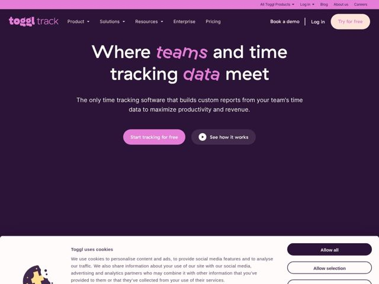

# Toggl — https://toggl.com

- **niche:** productivity
- **mood:** warm-playful
- **style:** dark, colorful, mono-type
- **palette:** bg `#2B1B36` · ink `#FFFFFF` · accent `#E579D6` — palavras-chave do hero em itálico (teams, data), pílula do CTA principal, wordmark do logo, barra utilitária superior, estados ativos da navegação
- **type:** display *Geometric rounded sans (GT Walsheim / Toggl custom rounded grotesque) with a quirky italic cut for emphasis words* · body *Clean humanist sans, generous line-height* — Amigável, arredondada, confiante mas acessível; os itálicos inclinados com cara de manuscrito injetam personalidade em um sistema geométrico de resto organizado
- **sections:** hero › feature-adoption › feature-productivity › feature-enterprise › how-it-works › feature-roi-calculator › cta › footer
- **signature:** Modo escuro em berinjela/ameixa profundo para uma ferramenta de controle de tempo — a categoria vive em dashboards brancos clínicos e azul corporativo, então uma tela roxa saturada com acentos rosa-doce lê como ousada e humana em vez de "utilitário corporativo".
- **imagery:** Esparsa, ilustrativa e voltada à marca, em vez de carregada de screenshots de produto no hero. Spot illustrations planas e divertidas (o mascote biscoito no banner de consentimento), geometria de pílulas arredondadas por toda parte, recurso de play de vídeo embutido no CTA secundário. Cor e tipografia carregam o peso visual, não a fotografia.
- **copy:** Direta, com enquadramento de benefício levemente atrevido, com palavras selecionadas em itálico para dar ritmo; hero: "Where teams and time tracking data meet."

**Takeaways (roube como ideias, não copie):**
- Use trocas seletivas de palavras em itálico dentro de um título de resto reto para adicionar voz e guiar o olhar — cor + inclinação apenas nas 2 palavras que importam (teams, data).
- Combine um sistema de botões totalmente em formato de pílula (CTA doce preenchido + ghost contornado com ícone de play inline) para fazer um hero de duplo CTA parecer coeso e tátil.
- Escolha uma base escura saturada inesperada (ameixa/berinjela) para uma categoria utilitária para escapar do mar de dashboards brancos e ainda assim parecer premium.
- Deixe o banner de cookie/consentimento carregar a personalidade da marca com uma ilustração de mascote, em vez de tratar a UI de conformidade como algo de última hora.
