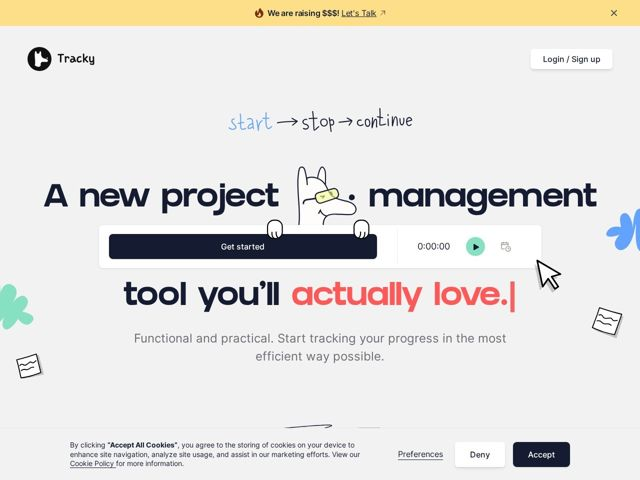

# Tracky — https://tracky.so

- **niche:** productivity
- **mood:** warm-playful
- **style:** illustrated, colorful, mono-type
- **palette:** bg `#F1F0EE` · ink `#1B2030` · accent `#FF5C5C` — the second half of the hero headline ('actually love.'), with secondary green (#5FD0A6) on the play button and scattered hand-drawn blob doodles
- **type:** display *Rounded geometric grotesk (heavy weight, large x-height — Quicksand / Baloo-like)* · body *Clean humanist sans (Inter / system-ui-like)* — Chunky and friendly — the fat rounded display reads as toy-like and approachable, deliberately the opposite of corporate PM-tool seriousness; a hand-drawn script ('start -> stop -> continue') adds a sketchbook layer on top
- **sections:** promo-banner › hero › problem › feature-overview › feature-notes › feature-todos › feature-tasks › feature-tables-invoices › feature-summary › testimonials › pricing › roadmap › footer
- **signature:** The hero text physically wraps AROUND a live product widget and a doodled llama mascot — the headline is split into fragments ('A new project [llama] management / tool you'll actually love') interrupted mid-sentence by a working timer card and a peeking hand-drawn animal, so the UI and the copy are collaged into one composition instead of stacked in tidy rows.
- **imagery:** Hand-drawn doodle illustration language: a sketchy llama/alpaca mascot in sunglasses, scribbled sticky-note shapes, clover/splat blobs in coral and blue-green, a cartoon mouse cursor, and a handwritten marker script. Mixed with one crisp real UI chip (the timer/Get-started card) — naive sketchbook art colliding with clean product screenshots.
- **copy:** Disarming, anti-enterprise voice that names the pain directly — hero reads "A new project management tool you'll actually love." with 'actually love' set in coral as the emotional payoff.

**Takeaways (steal as ideas, don't copy):**
- Split a single headline into fragments and let a product widget + mascot physically interrupt it mid-line — the copy and the UI become one collage, not stacked blocks.
- Color only the emotional payoff: keep the whole headline in dark ink and flip just the two key words ('actually love') to a hot coral so the eye lands on the promise.
- Pair one crisp, real product chip against loose hand-drawn doodles (sticky notes, blobs, a sketched mascot) so the page feels human and toy-like while still proving the product is real.
- Use a fat, rounded display type against a warm off-white (#F1F0EE) instead of pure white to deliberately read as the friendly opposite of a serious enterprise PM tool.
