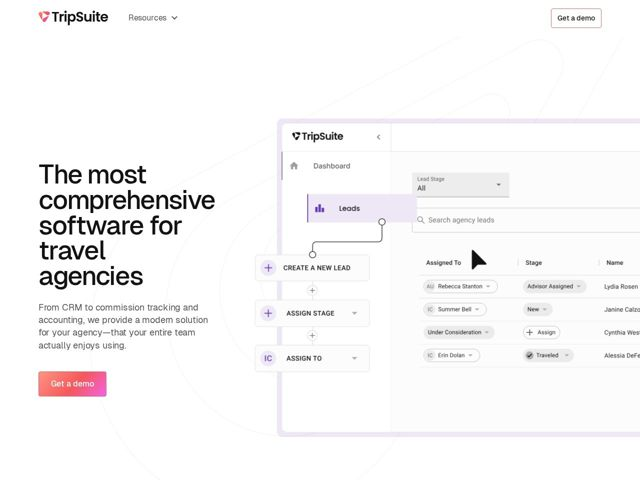

# Tripsuite — https://tripsuite.com

- **niche:** dev-tools (vertical SaaS — travel-agency CRM/back-office)
- **mood:** clean-light
- **style:** minimal, gradient, photographic
- **palette:** bg `#FFFFFF` · ink `#0F0F12` · accent `#F26B5E` — warm coral-to-pink gradient on the primary 'Get a demo' CTA button and the logo mark; subtle lilac (#7C5CFC) tints inside the product UI screenshot (active Leads nav, + icons)
- **type:** display *Geometric grotesk sans (Poppins / Gordita-like — circular 'o', single-story 'a')* · body *Neutral humanist sans (system-ui / Inter-like)* — Friendly-modern and approachable; the rounded geometric headline softens an otherwise enterprise back-office category
- **sections:** hero › feature-intro › problem › feature-pillars › feature-grid › cta › footer
- **signature:** A pure-white, near-empty hero where the giant left-aligned headline floats with no card, no border, no background panel — and the only color in the entire viewport is a single warm coral gradient button, deliberately importing consumer-travel warmth into a dry CRM/accounting category that normally defaults to corporate blue.
- **imagery:** High-fidelity product screenshot of the actual app (Leads pipeline, lead-stage workflow nodes, assignee chips) tilted into a floating browser-less panel on the right; faint hairline orbital line-art curves trace through the whitespace behind it. No stock photos, no people, no illustration — the UI itself is the hero image.
- **copy:** Confident category-claim headline with empathetic body; quote: 'The most comprehensive software for travel agencies' — backed by 'a modern solution for your agency—that your entire team actually enjoys using.'

**Takeaways (steal as ideas, don't copy):**
- Name the incumbent you're replacing: the H2 'Agency managers and advisors are no longer stuck in ClientBase and Trams' weaponizes legacy-tool fatigue as positioning — steal the 'no longer stuck in [old tool]' frame.
- Let real product UI be the only imagery and the only secondary color source — keep the page chrome monochrome so the screenshot's lilac accents read as a credible 'this is what you'll use' window.
- Pick a counter-category accent: a warm coral/pink gradient instead of trust-blue makes a back-office tool feel human; reserve it for exactly one CTA so it never dilutes.
- Three two-word virtue labels (Easy to use / One platform / Modern and fast) compress the value prop into a scannable rhythm before the deeper feature grid (CRM, Commission Tracking, Accounting, Itineraries, Analytics, Workflow Automation).
