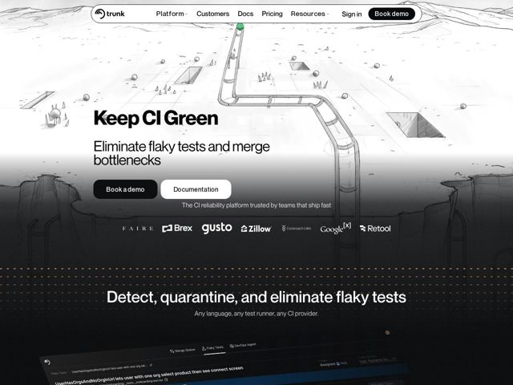

# Trunk — https://trunk.io

- **niche:** dev-tools
- **mood:** technical-dark
- **style:** illustrated, mono-type, cinematic, dark
- **palette:** bg `#0B0B0B` · ink `#0E0E0E` · accent `#1FA94A` — um único nó/ponto verde no início do caminho do pipeline na ilustração do hero; fora isso a página é quase monocromática
- **type:** display *Inter / neo-grotesque sans (tight-tracked, heavy weight)* · body *Inter / system grotesque sans* — Engenhosa, sem rodeios; títulos em grotesque pesada e bem apertada leem como rótulos de terminal em vez de texto de marketing
- **sections:** hero › logos › feature-detect-quarantine › feature-merge-queue › how-it-works › problem › feature-grid › footer
- **signature:** Uma paisagem isométrica em esboço a lápis desenhada à mão — um pipeline sinuoso serpenteando por penhascos e trincheiras — substitui o obrigatório hero de screenshot/dashboard de produto das ferramentas dev. Ilustra literalmente o "pipeline" de CI como uma jornada física, transformando um conceito abstrato de DevOps em um mundo esboçado.
- **imagery:** Ilustração em line-art a lápis/grafite: um terreno isométrico monocromático com um tubo 3D serpenteando por ele, textura desenhada à mão, sem cor exceto um único nó de início verde. O esboço claro do hero desbota de cima para baixo em uma seção preta onde uma UI de produto real e escura (dashboard de testes instáveis) emerge — uma transição deliberada de esboço para software. Linhas tracejadas de planta de engenharia delimitam os divisores de seção.
- **copy:** Voz direta e imperativa de status de sistema — o hero empilha um h1 conciso, tipo comando, sobre um benefício direto: "Keep CI Green" / "Eliminate flaky tests and merge bottlenecks."

**Takeaways (roube como ideias, não copie):**
- Leve uma metáfora de produto ao pé da letra: desenhe o 'pipeline' como um tubo realmente esboçado atravessando o terreno, em vez de mostrar um hero de dashboard.
- Mantenha-se impiedosamente monocromático e gaste sua ÚNICA cor de acento em um único ponto semântico (o nó verde de 'go') para que 'verde = build aprovado' leia instantaneamente.
- Engenheire uma mudança vertical de clima: abra em um esboço claro desenhado à mão, desbote para o preto e deixe a UI de produto real e escura emergir na junção — conceito primeiro, software depois.
- Use réguas tracejadas de planta e títulos concisos de terminal ('Detect, quarantine, and eliminate') para fazer a página parecer uma folha de especificações para engenheiros, não um pitch de vendas.
