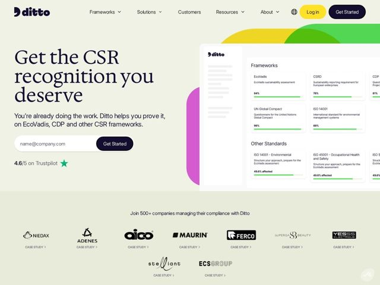

# Trustditto — https://trustditto.com

- **niche:** CSR / ESG compliance SaaS (sustainability reporting copilot)
- **mood:** clean-light
- **style:** minimal, colorful, illustrated
- **palette:** bg `#ECEDE3` · ink `#1A1438` · accent `#3DBA3D` — barras de progresso dentro do card de UI do produto (medidores de % de conformidade), mais uma estrela verde do Trustpilot; respingos secundários da marca em arco amarelo/lima/verde/magenta atrás do mockup do hero
- **type:** display *High-contrast serif (Fraunces / Recoleta-style) for the oversized hero H1* · body *Geometric sans-serif (Poppins / Gilroy-style) for nav, subhead and UI* — Editorial encontra amigável: um título serif literário suaviza o pavor da conformidade, enquanto a sans arredondada mantém o produto com cara de acessível e moderno em vez de jurídico-corporativo
- **sections:** nav › hero › logos › feature-speed › feature-platform › feature-knowledge-base › feature-questionnaire-automation › feature-insights › feature-partners › trust-tech-plus-human › testimonials › resources › cta › footer
- **signature:** O dashboard de conformidade é arrastado pela metade para fora da borda direita da viewport, sangrando atrás de um arco arco-íris (amarelo para lima para verde) e um blob magenta — transformando uma árida ferramenta de auditoria ESG em um pôster caloroso, quase brincalhão. Software de conformidade quase universalmente vai para o azul-marinho-corporativo-sério; este se inclina para o sálvia-pastel e o editorial.
- **imagery:** Screenshot realista do produto no app (grade de Frameworks com medidores de conclusão verdes ao vivo) mostrado como um card arredondado flutuante, cortado na borda da página para dar impulso. Repousa sobre arcos/blobs coloridos orgânicos e sobrepostos (arco-íris eco + magenta) que leem como energia de marca. Os logos de clientes são wordmarks em cinza monocromático sob um único subtítulo, cada um marcado com 'CASE STUDY >' para que a prova social também sirva de navegação.
- **copy:** Voz empática, que prioriza a validação e inverte a conformidade de tarefa chata para crédito — hero: "Get the CSR recognition you deserve" com o subtítulo "You're already doing the work. Ditto helps you prove it."

**Takeaways (roube como ideias, não copie):**
- Lidere com a vitória oculta do usuário, não com o recurso: 'you're already doing the work, we help you prove it' reformula um fardo de conformidade como reconhecimento conquistado.
- Use um serif literário de alto contraste em escala massiva sobre um fundo sálvia/off-white para fazer uma categoria regulada e árida parecer premium e humana em vez de azul-marinho-corporativa.
- Codifique o valor do produto visualmente — barras de progresso verdes ao vivo numa grade de frameworks (EcoVadis 94%, ISO 88%) mostram a '% de conformidade' como a prova do hero, sem necessidade de ilustração abstrata.
- Transforme o mural de logos em navegação: anexe 'CASE STUDY >' sob cada marca de cliente para que os sinais de confiança também se tornem caminhos de prova clicáveis.
