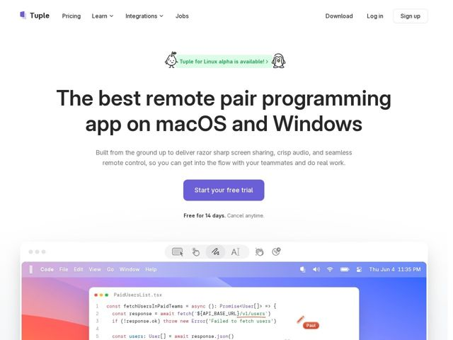

# Tuple — https://tuple.app

- **niche:** dev-tools
- **mood:** clean-light
- **style:** minimal, mono-type, photographic
- **palette:** bg `#FFFFFF` · ink `#1A1A2E` · accent `#6C5CE7` — preenchimento do botão CTA principal ('Start your free trial'), palavras-chave de realce de sintaxe no mockup de código e o destaque da pílula verde de anúncio
- **type:** display *Inter / Inter-like geometric grotesque (tight-tracked, heavy weight)* · body *Inter (regular, medium-grey)* — Sans confiante e de precisão de engenharia, sem floreios; o peso pesado do display lê como um manifesto de produto, não enrolação de marketing
- **sections:** nav › announcement-pill › hero › feature-product-shot › logos › feature-performance › feature-app-veil › feature-built-by-developers › testimonials › feature-fun › cta › footer
- **signature:** O hero não mostra uma UI polida — ele te joga direto em um desktop macOS real rodando uma sessão ao vivo do VS Code com TypeScript de verdade na tela, uma barra de ferramentas de anotação flutuando acima e o cursor nomeado de um colega de equipe ("Paul") no meio do pareamento. A foto do produto É uma sessão de pareamento flagrada em ação, não um dashboard encenado.
- **imagery:** Screenshots de produto hiper-literais: uma janela emoldurada, sem cromo de navegador, mostrando um desktop macOS autêntico com código real, realce de sintaxe real e um HUD de anotação flutuante. Mascotes de rabisco desenhados à mão (uma pera com um broto, o pinguim Tux do Linux) flanqueiam a pílula de anúncio — um abalo deliberado de calor contra o layout de resto clínico.
- **copy:** Superlativo direto e opinativo voltado a engenheiros — hero: "The best remote pair programming app on macOS and Windows".

**Takeaways (roube como ideias, não copie):**
- Faça da foto do produto no hero uma sessão de trabalho real congelada no meio da ação (código ao vivo + cursor nomeado de colega + barra de ferramentas flutuante) em vez de um dashboard vazio idealizado — vende o caso de uso, não o cromo
- Combine um layout sans-serif clínico e de alta confiança com um ou dois mascotes de rabisco desenhados à mão para injetar personalidade sem diluir a credibilidade de engenharia
- Use os títulos de seção como uma sequência de declarações opinativas ('Engineers deserve sharp tools', 'Native where it counts', 'Obsessed with performance') para que a página leia como um manifesto com o qual um desenvolvedor concordaria balançando a cabeça
- Mantenha o único roxo de acento disciplinado: reserve-o para o único CTA e deixe o mockup de código com realce de sintaxe fornecer o resto da cor
