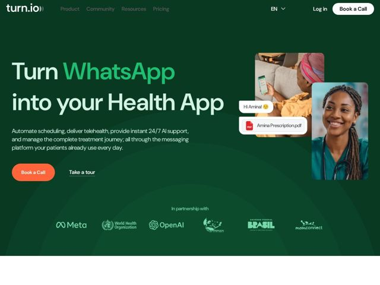

# Turn — https://turn.io

- **niche:** healthtech
- **mood:** premium-luxe
- **style:** dark, photographic, colorful
- **palette:** bg `#0E3A2A` · ink `#DCEFE4` · accent `#F2622E` — Apenas o botão CTA principal ('Book a Call'); um verde-azulado secundário (#37C16E) acentua a palavra destacada do título e os números das métricas
- **type:** display *DM Sans* · body *DM Sans / Arial* — sans humanista geométrica, pesos muito grandes de cantos suaves; amigável, limpa e acessível em vez de clínica
- **sections:** hero › logos › problem › feature-automate › how-it-works › testimonials › cta-accelerator › footer
- **signature:** Chips de UI de chat ao vivo flutuantes (bolha de saudação + pílula de prescrição em PDF) pairando sobre fotos de pacientes/médicos — encenando a conversa do WhatsApp como o produto, em vez de mostrar um screenshot de dashboard.
- **imagery:** Liderada por fotografia: fotos documentais e calorosas de pacientes e médicos africanos em cards de retângulo arredondado, em camadas com chips flutuantes de UI do WhatsApp (bolha de chat "Hi Amina!", um anexo de prescrição em PDF) para dramatizar o produto sem um screenshot literal.
- **copy:** Título com resultado-como-produto e uma palavra de destaque "WhatsApp" em verde-azulado. Hero: "Turn WhatsApp into your Health App" — confiante, priorizando o benefício, nomeia a plataforma que os pacientes já usam.

**Takeaways (roube como ideias, não copie):**
- Combine uma tela verde-floresta profundo com um único CTA laranja-quente para que a única ação que você quer seja a única coisa quente na tela — todo o resto recua.
- Destaque um verbo/substantivo do título em um tom saturado mais brilhante (verde-azulado aqui) para codificar a promessa central em uma única palavra colorida.
- Substitua o obrigatório screenshot de produto por chips de UI de chat cortados (bolha de saudação, anexo de arquivo) flutuando sobre fotos humanas reais — vende o produto de mensagens de forma mais calorosa do que um mockup de UI.
- Lidere a seção de prova com métricas de resultado concretas, expressas como deltas (567%, 65%, -13%, '10 min to 9 sec') no verde de acento brilhante, atreladas diretamente a depoimentos citados de operadores.
