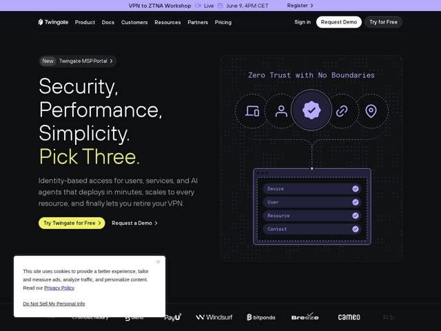

# Twingate — https://twingate.com

- **niche:** security
- **mood:** technical-dark
- **style:** dark, mono-type, gradient
- **palette:** bg `#0E0B1A` · ink `#FFFFFF` · accent `#E8F25C` — amarelo lima/chartreuse na terceira palavra do hero ('Pick Three.'), na pílula do CTA principal 'Try Twingate for Free' e nos estados de link/hover; um violeta secundário (#8B7FF0) carrega os nós do diagrama do produto
- **type:** display *Geometric grotesque sans (heavy weight, tight leading) for the H1* · body *Humanist sans for paragraph copy; IBM Plex Mono / monospace for diagram and decorative labels* — Confiante como engenheiro: um título em bloco e ousado ancorado por monospace estilo terminal que sinaliza 'feito por gente de infra, para gente de infra'
- **sections:** topbar-event-banner › hero › logos › feature-zero-trust-platform › feature-remote-access › feature-internet-access › feature-identity-aware › feature-deploy-speed › stats › testimonials › rating › feature-zero-trust-as-code › feature-integrations › blog › cta › footer
- **signature:** O título transforma um cansado trade-off de engenharia em uma piada: "Security, Performance, Simplicity." em branco, depois "Pick Three." em lima — invertendo o clássico axioma "pick two". Uma única palavra fazendo todo o trabalho de atitude da marca, enquanto o diagrama do produto permanece calmamente geométrico.
- **imagery:** Sem fotografia. Um esquema vetorial customizado do produto sobre uma tela escura com grade pontilhada: cinco nós circulares de glifos (dispositivo, usuário, selo verificado, link, localização) conectados por linhas tracejadas até um card flutuante listando Device / User / Resource / Context com checkmarks verdes — abstraindo o fluxo de política de acesso em um diagrama limpo, com cara de animado, em vez de um screenshot de UI.
- **copy:** Título espirituoso com inversão de axioma e subtexto de benefício direto — "Security, Performance, Simplicity. Pick Three." depois uma promessa de uma frase que termina na recompensa emocional: "finally lets you retire your VPN."

**Takeaways (roube como ideias, não copie):**
- Isole por cor a palavra da recompensa: mantenha o título monocromático, depois solte o único tom de acento na única palavra que carrega o argumento ('Pick Three.') para que o olhar pouse na ideia, não apenas na tipografia.
- Use monospace como uma textura de marca, não só para código — componha rótulos de diagrama e legendas decorativas ('Zero Trust with No Boundaries', Device/User/Resource/Context) em uma fonte de terminal para telegrafar credibilidade técnica sem um screenshot.
- Substitua os screenshots de produto por um esquema abstrato de nós e cards sobre uma grade pontilhada — ele explica o mecanismo (identity -> resource -> context) ao mesmo tempo que permanece perene e sob controle da marca.
- Enquadre a pilha de H2 em torno de resultados e prova (90% / 99.99% / 86% / 4.9) para que a estética técnica escura seja equilibrada por números concretos e escaneáveis.
