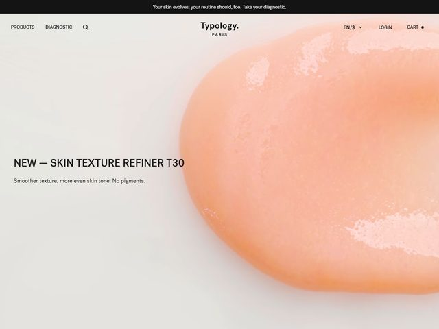

# Typology — https://us.typology.com

- **niche:** beauty
- **mood:** editorial-minimal
- **style:** minimal, photographic, editorial, macro
- **palette:** bg `#F1EEEA` · ink `#1A1A1A` · accent `#E8A088` — O "acento" não é nem uma cor de UI; é o tom pêssego-coral do próprio sérum do produto, espalhado pela metade direita do hero. Todo o cromo (nav, título, texto dos botões) é preto quase puro sobre um off-white quente; a única saturação na página vem do próprio produto.
- **type:** display *grotesque sans, all-caps, loose-tracked — think Founders Grotesk / Söhne* · body *same family, regular weight, sentence case* — Quieta, clínica, com a contenção de um caderno de laboratório; a tipografia sussurra para que o produto possa falar.
- **sections:** hero › diagnostic-quiz › bestsellers › ingredient-transparency › routine-builder › reviews › sustainability › cta › footer
- **signature:** O hero é uma única fotografia macro enorme do próprio sérum — uma gota brilhante cor de pêssego espalhada sobre uma superfície clara, iluminada para que se veja cada realce viscoso e a borda seca e empoeirada onde ele seca. Sangra para fora das bordas direita e superior, em full-bleed e sem corte por qualquer moldura, enquanto o texto fica pequeno e alinhado à esquerda no espaço negativo do fundo nu. A própria textura do produto É a imagem do hero; sem modelo, sem frasco, sem styling — só a substância, fotografada como uma amostra de ciência.
- **imagery:** Fotografia macro de produto, clínica e tátil. Close-up extremo da textura física do sérum sobre uma superfície neutra, iluminação natural suave, sombras e brilho de superfície reais. Lê mais como uma lâmina de dermatologia do que um anúncio de beleza — zero ilustração, zero 3D, zero lifestyle.
- **copy:** Reduzida ao essencial, priorizando ingredientes, quase como um SKU. Barra promocional superior: 'Your skin evolves; your routine should, too. Take your diagnostic.' Título com eyebrow fundido 'NEW — SKIN TEXTURE REFINER T30', subtítulo 'Smoother texture, more even skin tone. No pigments.' O código do produto (T30) é tratado como parte do nome — engenheirado, não romântico.

**Takeaways (roube como ideias, não copie):**
- Faça da textura crua do produto o hero, fotografando um único macro full-bleed da substância real — sem frasco, sem modelo, sem moldura — e deixe sua cor natural ser seu único acento.
- Mantenha todo o cromo (nav, título, CTA) em preto quase puro e plano sobre um off-white quente para que o único tom fotográfico carregue 100% da saturação da página.
- Funda o eyebrow no título como um 'NEW —' prefixado por traço e anexe um código clínico de produto (T30) para que o nome leia como engenheirado em vez de comercializado.
- Use a barra promocional superior para uma filosofia de pele de uma linha mais um CTA suave ('Take your diagnostic') em vez de um desconto — define um tom consultivo e científico antes mesmo de o hero carregar.
