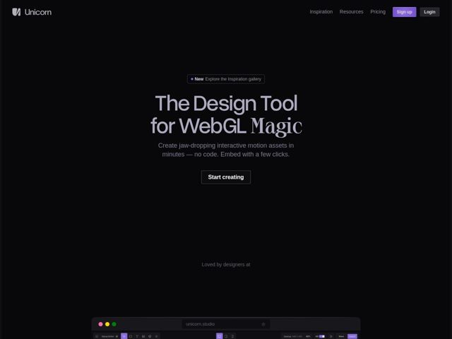

# Unicorn — https://unicorn.studio

- **niche:** design-tools
- **mood:** technical-dark
- **style:** dark, minimal, cinematic, mono-type
- **palette:** bg `#0A0A0B` · ink `#E8E6E9` · accent `#A78BFA` — Sign-up button fill, the dot inside the 'New' announcement pill, and (off-screen) the live WebGL gradient effects rendered in the docked editor mockup
- **type:** display *A geometric grotesque sans for most of the H1 (rounded, near-monoline 'g', tall x-height) paired with a high-contrast serif italic swash for the word 'Magic'* · body *IBM Plex Mono* — Editorial-meets-engineering: a tool that takes itself seriously as a craft instrument. The mono body signals 'made for technical creatives' while the serif-italic flourish injects a touch of romance and theatre.
- **sections:** nav › hero › logos › footer
- **signature:** The hero swaps a single word ('Magic') into a high-contrast serif italic mid-sentence, breaking the all-sans dev-tool convention — typography itself performs the 'magic' the product sells, rather than relying on a screenshot to prove it.
- **imagery:** Almost no decorative imagery in the fold — the page leans on void. The one image is a stylized browser-chrome mockup (traffic-light dots, URL bar reading 'unicorn.studio') docked at the very bottom, framing the actual editor UI as the hero asset. The product demos itself rather than using stock illustration.
- **copy:** Confident, benefit-first with a craft swagger; hero reads 'The Design Tool for WebGL Magic' followed by 'Create jaw-dropping interactive motion assets in minutes — no code. Embed with a few clicks.'

**Takeaways (steal as ideas, don't copy):**
- Mixed-script headline: keep 95% of an H1 in your workhorse sans, then render ONE emotionally-loaded word in a contrasting serif italic — the swap does all the personality work for free.
- Use a mono typeface (IBM Plex Mono) for body and UI labels to instantly signal 'technical creative tool' without any other dev-coded visuals.
- Dock a realistic browser-chrome frame of your actual product at the bottom of the fold so the page itself becomes a live demo surface — the product is the hero image.
- Let the accent be scarce: a single violet (#A78BFA) on one CTA and one pill dot reads as more premium against near-black than a fully colored palette.
