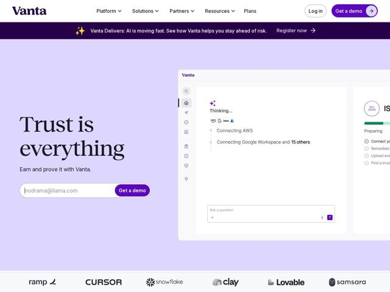

# Vanta — https://vanta.com

- **niche:** security
- **mood:** clean-light
- **style:** minimal, illustrated, colorful
- **palette:** bg `#E2DAF7` · ink `#1A1033` · accent `#6D28D9` — primary CTA pills (Get a demo), purple top announcement bar, navigation logo wordmark, in-product UI chrome accents and the send-arrow button
- **type:** display *High-contrast serif (transitional/Didone-like, e.g. Tiempos/Canela family)* · body *Geometric/grotesque sans-serif (Inter-like)* — Editorial gravitas meets engineered calm — the serif lends an old-money 'trust/institution' authority while the clean sans keeps the product feeling modern and legible
- **sections:** hero › logos › feature-it's-all-here › testimonials › feature-frameworks › feature-built-for-you › feature-proof › awards › resources › cta › footer
- **signature:** A giant high-contrast SERIF hero headline ("Trust is everything") on a soft lavender wash — security/compliance SaaS almost universally defaults to cold blue-grey gradients and clinical sans-serif; Vanta instead reaches for editorial-magazine typography and a warm pastel field, dressing a deeply technical GRC product as something trustworthy and human rather than enterprise-sterile.
- **imagery:** A floating, drop-shadowed product UI panel (the Vanta Agent "Thinking..." chat connecting AWS, Google Workspace + 15 others, building toward an ISO cert) bleeds off the right edge to imply depth and ongoing automation. Tiny real integration logos (AWS, Google, GitHub) and a sparkle/AI glyph signal live agentic work. Below, a monochrome customer logo row (ramp, Cursor, Snowflake, Clay, Lovable, Samsara) anchors credibility.
- **copy:** Aphoristic, three-word brand-promise headline backed by a plain imperative subline — confident and human, not feature-led. Hero: "Trust is everything" / "Earn and prove it with Vanta."

**Takeaways (steal as ideas, don't copy):**
- Pair a near-Didone display serif with a clean sans body to inject 'institutional trust' into a technical category without going corporate-cold.
- Wash the whole hero in a single soft pastel (lavender) instead of a gradient — calmer, warmer, and lets one saturated purple accent do all the CTA work.
- Make the product shot DO something: an in-progress agent 'Thinking...' state mid-task sells live automation far better than a static dashboard.
- Drop an email-capture field directly into the hero next to the primary CTA so the convert action lives above the fold, not buried.
