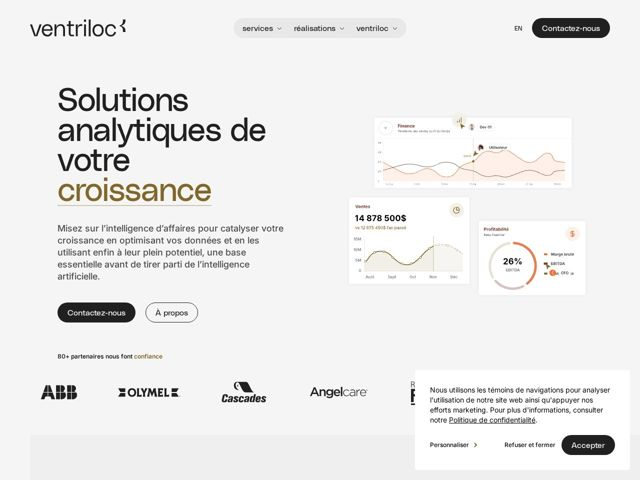

# Ventriloc — https://ventriloc.ca

- **niche:** data-analytics (business intelligence / Power BI consultancy)
- **mood:** clean-light
- **style:** minimal, mono-type, bento
- **palette:** bg `#F4F2EF` · ink `#1A1A1A` · accent `#8C6D34` — single underlined hero keyword ('croissance') in warm bronze/gold; echoed faintly in the dashboard chart strokes (coral/orange data lines)
- **type:** display *Inter (tight, near-display weight at large sizes)* · body *Inter* — Geometric grotesque pushed to an oversized, low-contrast display register — the same neutral workhorse font carries both headline and body, so hierarchy comes from scale and the lone gold underline rather than from a second typeface
- **sections:** hero › logos › feature-grid (services: visualization, data engineering, governance, UI/UX, apps & automation, data agents, helpdesk) › feature (Microsoft tech / certified) › how-it-works (data as organizational asset) › cta › footer
- **signature:** A single hero keyword ('croissance') is the ONLY colored element on an otherwise grayscale page — hand-underlined in warm bronze gold instead of the obligatory electric-blue/cyan that BI and data dashboards default to. The warm, almost editorial neutral palette quietly rejects the cold corporate-tech aesthetic of the entire Power BI/Azure niche.
- **imagery:** Floating, layered product-UI cards (bento-style) of mock BI dashboards — a finance line chart, a sales figure card with sparkline, a profitability donut ring — rendered in soft cream/coral on white with drop shadows and little orbiting avatar/status chips. Imagery is the product itself, abstracted into clean tiles rather than screenshots, signalling 'data made calm and legible'.
- **copy:** Outcome-first, French, confident-consultant voice that sells growth over tooling — hero: "Solutions analytiques de votre croissance" (analytics solutions for your growth)

**Takeaways (steal as ideas, don't copy):**
- Color a single word, not a section: keep the whole page neutral and let one hand-underlined keyword in an unexpected warm hue carry all the brand emotion.
- Use one typeface for everything (Inter here) and manufacture hierarchy purely through dramatic size jumps — the H1 dwarfs the body to near-poster scale.
- Swap the cold blue cliché of the data/BI niche for a warm cream + bronze palette to feel like a boutique consultancy, not enterprise software.
- Float product dashboards as separated bento cards with orbiting avatar/status chips so the UI reads as 'living' without a real screenshot.
