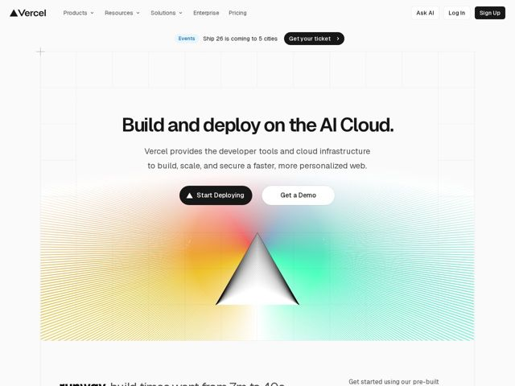

# Vercel — https://vercel.com

- **niche:** dev-tools
- **mood:** clean-light
- **style:** minimal, gradient, mono-type
- **palette:** bg `#FFFFFF` · ink `#0A0A0A` · accent `#0070F3` — Sparse by design — the white-on-page accent is the rainbow prism gradient (orange→green→cyan) in the hero centerpiece; flat brand blue (#0070F3) is reserved for inline links and the 'Events' eyebrow tag. Primary CTAs and the logo are pure black, not the accent. Accent is an event, not a wash.
- **type:** display *Geist (Geist Sans, Vercel's in-house grotesque)* · body *Geist Sans, with Geist Mono for code, labels and UI microcopy* — Engineered neo-grotesque — tight tracking, near-black weight on the H1, geometric but warm. Reads precise and 'built by engineers' without feeling cold; the mono accent signals a dev-tools product.
- **sections:** nav › announcement-banner › hero › logos › feature-build › feature-scale › feature-secure › how-it-works › resources › cta › footer
- **signature:** A monochrome line-art pyramid (the Vercel triangle reconstructed from hundreds of thin radiating strokes) sitting on a soft full-spectrum prism gradient — the ENTIRE page is black-on-white except this one luminous hero object, which doubles as the logo. The brand mark IS the hero illustration.
- **imagery:** Hybrid generative line-art over gradient-mesh: a triangle reconstructed from hundreds of thin radiating strokes, set on a full-spectrum prism gradient (orange→yellow→green→cyan). Treatment is technical and quiet — moiré contour lines, a faint dotted blueprint grid framing the fold, and dominant whitespace. No photography or generic 3D; the only saturated color in the fold is this one engineered light source.
- **copy:** Confident infrastructure-as-a-promise voice — short declarative product claim, real hero H1: 'Build and deploy on the AI Cloud.' Subhead pairs developer-audience nouns with outcome verbs: 'Vercel provides the developer tools and cloud infrastructure to build, scale, and secure a faster, more personalized web.'

**Takeaways (steal as ideas, don't copy):**
- Spend your entire color budget on ONE hero object. Keep the whole page monochrome (black ink, white bg, black CTAs) and let a single prismatic gradient illustration carry all the emotion — restraint makes the one colorful moment unforgettable.
- Make the logo and the hero art the same object. The radiant triangle is literally the brand mark scaled up and rendered in line-art, so the illustration reinforces identity instead of being decoration.
- Frame the fold with a faint dotted/plus-tick blueprint grid. It signals 'engineering precision' to a dev audience and gives an otherwise empty white hero structure without adding visual weight.
- Stack the page on a three-verb spine — Build / Scale / Secure as repeated H2 section headers — so the product narrative is skimmable in three words and the feature sections feel like one rhythm, not a list.
- Pair a neo-grotesque display face (Geist) with a mono companion for eyebrow tags and UI labels; the mono is the cheapest, clearest way to say 'this is a developer product' without an illustration.
