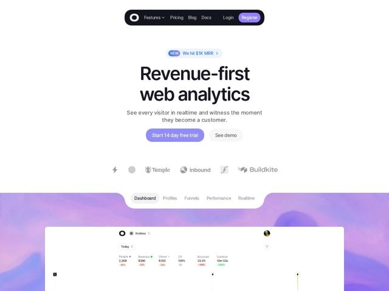

# Visitors — https://visitors.now

- **niche:** analytics
- **mood:** clean-light
- **style:** minimal, gradient, bento
- **palette:** bg `#FFFFFF` · ink `#1A1A1F` · accent `#8B7FF0` — Primary CTA button fill, Register button, NEW badge text, and a soft purple-to-pink aurora gradient band behind the product dashboard
- **type:** display *Geist / Inter-style geometric grotesque* · body *Same neo-grotesque sans, lighter weight* — Confident and modern; oversized bold display headline paired with calm light-grey body text — tech-credible without being cold
- **sections:** nav › hero › logos › feature-product-preview › feature-grid › how-it-works › comparison › pricing › testimonials › faq › cta › footer
- **signature:** Testimonials carry dual identities — a real human name AND a randomized animal codename (Quirky Penguin, Fluffy Koala, Speedy Rabbit). It turns the product's own privacy/anonymization premise into a witty design device, breaking the sterile credibility-theater convention of analytics testimonials.
- **imagery:** No photography. Imagery is the product itself — a high-fidelity, slightly tilted dashboard UI screenshot framed by a tabbed control bar (Dashboard / Profiles / Funnels / Performance / Realtime). It floats over a dreamy purple aurora gradient that bleeds upward, making clinical analytics data feel atmospheric. Greyscale partner logos sit in a quiet trust row.
- **copy:** Blunt benefit-as-positioning headline that reframes the category: "Revenue-first web analytics" — subhead promises the emotional payoff ("witness the moment they become a customer").

**Takeaways (steal as ideas, don't copy):**
- Lead with a category reframe, not a feature: 'Revenue-first web analytics' picks a fight with vanity-metric tools in three words.
- Use a live metric as social proof in the announcement pill — 'NEW · We hit $1K MRR' makes the brand feel transparent and in-progress.
- Make the product preview interactive-looking: a tab bar (Dashboard/Profiles/Funnels/Realtime) above the dashboard implies depth without building extra sections.
- Let the brand thesis leak into micro-copy — anonymized animal codenames on testimonials prove the privacy promise instead of just stating it.
