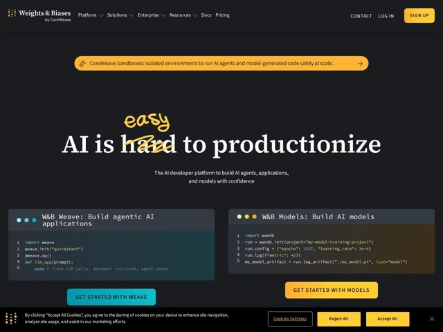

# Wandb — https://wandb.ai

- **niche:** ai
- **mood:** technical-dark
- **style:** dark, mono-type, bold-loud
- **palette:** bg `#1A1A1D` · ink `#FFFFFF` · accent `#FFC93C` — hand-drawn scribble over the headline, primary CTA buttons, announcement banner, logo mark dots, and syntax highlighting in code blocks
- **type:** display *High-contrast serif (Didone-style, e.g. GT Sectra / Tiempos-like)* · body *Neutral grotesque sans-serif (e.g. Inter / Source Sans), monospace for code* — Editorial gravitas (serif) deliberately collided with engineer-honest monospace and a handwritten marker scribble — academic authority meets hacker workbench
- **sections:** nav › announcement-banner › hero › feature-dual-code-demo › cta-pair
- **signature:** The hero headline literally edits itself: "AI is hard to productionize" with "hard" struck through and a hand-drawn marker "easy" scrawled above it in accent yellow — a self-correcting sentence that turns the value prop into a visible gesture, breaking the polished gradient-deck convention of AI SaaS.
- **imagery:** No photography or 3D. The "imagery" is functional product proof: two side-by-side terminal/IDE windows with macOS traffic-light dots and real, syntax-highlighted Python (import weave / import wandb). Diegetic interface chrome stands in for a hero illustration — code IS the visual.
- **copy:** Confrontational problem-first headline that corrects itself in real time — real hero: "AI is hard [easy] to productionize", subtitled "The AI developer platform to build AI agents, applications, and models with confidence."

**Takeaways (steal as ideas, don't copy):**
- Annotate your own headline: strike a word and overlay a hand-drawn correction in the accent color to dramatize a before/after promise without a single illustration.
- Split the hero into two real code windows (one per product line) so prospects self-select by use case and see the API surface as proof in the first scroll.
- Pair a high-contrast editorial serif display with monospace code and a marker scribble — three voices (authority, engineering, human) to escape flat sans uniformity.
- Lean into near-black charcoal + a single warm marigold accent reserved only for CTAs and the one signature gesture, keeping the dark UI calm but pointed.
