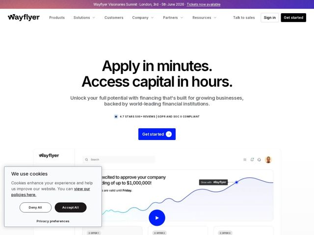

# Wayflyer — https://wayflyer.com

- **niche:** fintech
- **mood:** clean-light
- **style:** minimal, gradient, mono-type
- **palette:** bg `#FFFFFF` · ink `#0A0A0A` · accent `#2F4BFF` — primary CTA button fill (Get started), the in-product growth-curve line chart, and live-link underlines; a violet-to-coral gradient runs across the top announcement bar
- **type:** display *Geometric grotesque sans (Wayflyer custom / DM Sans-like) with tightly tracked, heavy weight* · body *Same humanist sans family at regular weight, mid-grey* — Confident and plainspoken — oversized, almost-cramped headline tracking reads like a financial statement, not a startup. No serifs, no flourish, all trust.
- **sections:** announcement-bar › hero › feature-fast-capital › feature-data-funding › stat-6b-deployed › how-it-works › pricing-transparent-fee › testimonials › logos › feature-multichannel › cta-talk-to-experts › footer
- **signature:** The two-sentence hero set as a giant stacked period-punctuated couplet ("Apply in minutes. / Access capital in hours.") — fintech usually leads with a benefit phrase; here the full-stops turn the value prop into a confident verbal cadence, copy doing the visual heavy-lifting instead of imagery.
- **imagery:** A single floating product-UI mockup (dashboard with a search bar, an approval banner "$1,000,000", a rising blue line chart, and stacked OFFER cards) sitting on near-white with a soft drop shadow. A circular play button overlays it, signaling a product demo. No stock photos in the hero — the dashboard IS the imagery, kept light and screenshot-real.
- **copy:** Plainspoken, outcome-first cadence with periods as rhythm — confident lender voice. Hero: "Apply in minutes. Access capital in hours."

**Takeaways (steal as ideas, don't copy):**
- Use full-stop punctuation inside an oversized hero to create verbal rhythm — two short declarative sentences stacked read as a promise, not a tagline.
- Bake an inline trust strip directly under the subhead (star icon + '4.7 stars 500+ reviews | GDPR and SOC II compliant') so social proof and compliance land before the fold.
- Let a realistic product dashboard be the hero visual, with a concrete dollar figure ('approve your company funding of up to $1,000,000') hardcoded in the mock to make the abstract benefit tangible.
- Theme section headings with playful editorial labels (Suds to success, Basement to boutiques, Off the leash) so a dense fintech page stays human and skimmable.
